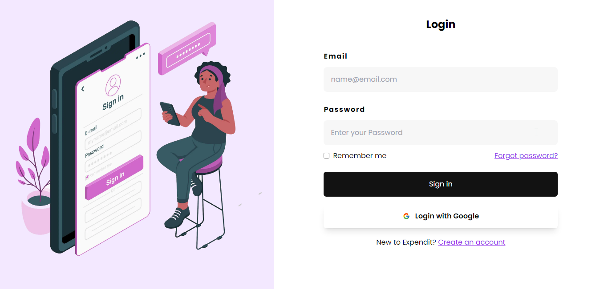

# Overview

### Overview

<<<<<<< HEAD
User Authentication and Authorization in the Expendit app are designed to provide a secure, fast, and convenient way for users to interact with the application. This documentation outlines the two crucial aspects of the authentication and authorization process and explains the implementation details.

### Authentication
Authentication verifies the identity of users attempting to log into the Expendit app. It answers the question: Should this person be allowed in, and if yes, who are they?
=======
Every Auth system has two parts:

- **Authentication**: should this person be allowed in? If yes, who are they?
- **Authorization**: when users access the app, what are they allowed to do?

### Authentication
>>>>>>> 77a39eff727314bbc4eec6fc6a984fd017c3cc67

The Expendit App uses a Password-based method for authentication (email and password).


### Authorization
<<<<<<< HEAD
Authorization dictates what actions or resources a user is allowed to access within the app. It answers the question: When users access the app, what are they allowed to do?
=======
>>>>>>> 77a39eff727314bbc4eec6fc6a984fd017c3cc67

A ProtectedRoute component is created and used to prevent an unknown user from accessing the app, the page is redirected to the sign-in page instead.

```tsx
export const ProtectedRoute: React.FC<ProtectedRouteProps> = ({ children }) => {
  const router = useRouter();
  const { isLoading } = useSession();

  const storedValue: string | null = getLocalStorageItem("ExpenditLoggedIn");
  const isUserLoggedIn: string =
    storedValue !== null ? JSON.parse(storedValue) : null;

  useEffect(() => {
    if (!isUserLoggedIn) {
      router.push("/signin");
    }
  }, [router, isUserLoggedIn]);

  if (!isUserLoggedIn || isLoading) return <FullPageLoader />;

  return <>{children}</>;
};
```

<<<<<<< HEAD
### Authentication Process
1. **User Registration:**
* When the user signs up, The Common server creates a new user in the database
* A unique UserID is assigned to the user.
2. **User Login:**
* When the user logs in, the Common server returns a JSON Web Token (JWT).
* This JWT is used for subsequent requests to the database to authenticate the user.
3. **Session Management:** 
* The user remains logged in for a specific duration.
* After the session expires, the JWT is cleared from storage.
* The *ProtectedRoute* component detects the absence of a valid JWT and redirects the user to the sign-in page.

### Security Measures
To ensure the security of user authentication and authorization, the following measures are implemented:

* Passwords are stored securely using industry-standard encryption algorithms.
Use of JWT for secure and stateless authentication.
* The ProtectedRoute component helps prevent unauthorized access to protected routes.
* Secure session management to handle user logins and logouts effectively.

### Best Practices for Users
* Use a strong and unique password for enhanced security.
* Log out when using shared or public computers to prevent unauthorized access.
* Keep the login credentials confidential and avoid sharing them with others.
* By following these practices and understanding the authentication and authorization flow, users can confidently and securely interact with the Expendit app.
=======
### How it works

1. The user signs up. The Common server creates a new user in the database and a UserID is assigned to the user.
2. When the user logs in, the Common server returns a JWT. Every request to the database sends this JWT.
3. The user stays logged in for a specific time, after which the JWT is cleared from storage and the website re-routes to the sign-in page by the ProtectedRoute component.
>>>>>>> 77a39eff727314bbc4eec6fc6a984fd017c3cc67
