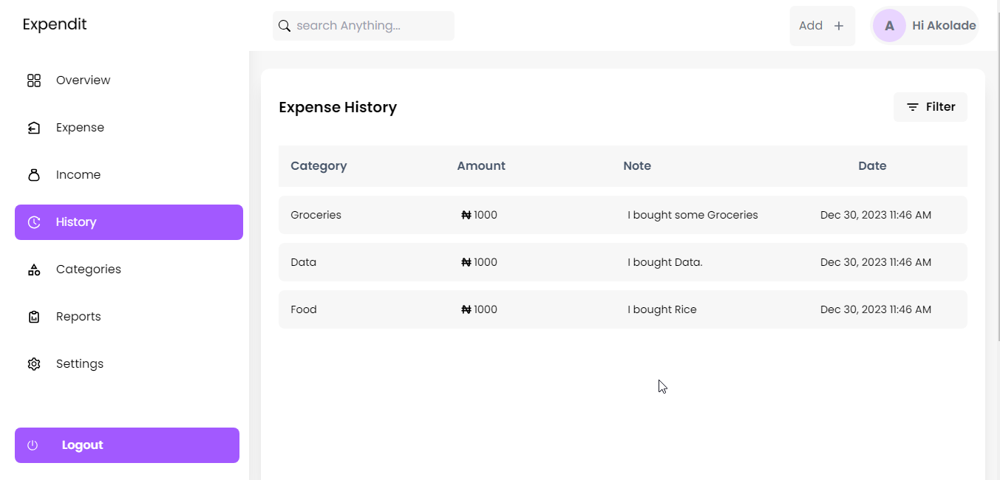
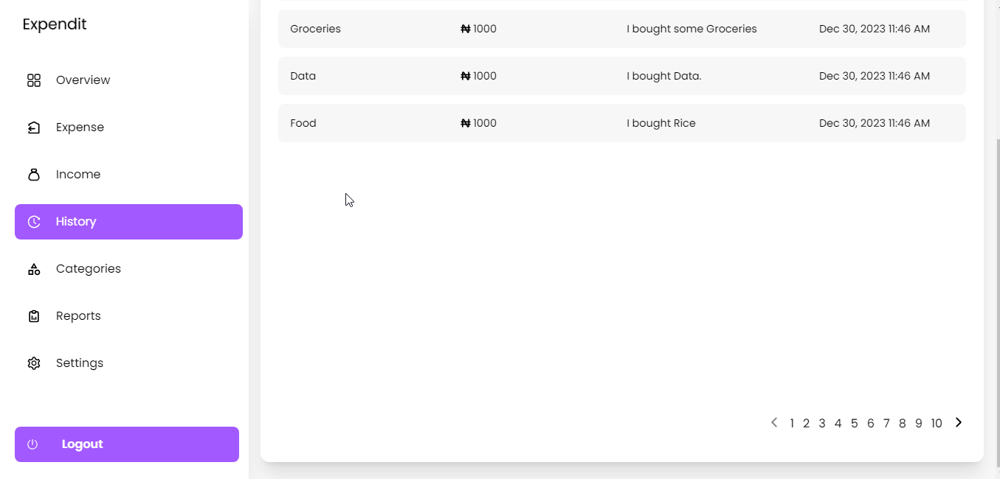

# Overview

Welcome to the History Page of our Expense Tracker web app! This page is designed to provide a detailed overview of your transaction history, making it easy for you to track and analyze your past expenses.

## Transaction History Table

The heart of the History Page is the Transaction History Table, which presents a comprehensive list of your past expenses. The table includes the following fields:

- **Category:** Displays the expense category, helping you categorize and identify spending patterns.
- **Note:** Provides a brief description or note associated with each expense for additional context.
- **Date:** Indicates the date when the expense occurred.
- **Amount:** Shows the expense amount, giving you a quick overview of the financial impact.

## Table Pagination

To enhance user experience and manage large datasets, the Transaction History Table incorporates a numbering pagination feature. This allows you to navigate through different pages of your transaction history with ease.

## Filtering by Category

The History Page includes a convenient filtering option that allows you to narrow down your transaction history based on expense categories. This feature is particularly useful when you want to focus on specific types of expenses, making it easier to analyze spending habits in specific areas.

## How to Use the History Page

1. **Accessing the History Page:**

   - Navigate to the main dashboard or use the navigation menu to access the "History" page.

2. **Transaction History Table:**

   - The Transaction History Table is prominently displayed, showcasing your expenses with relevant details.

   

3. **Pagination:**

   - Use the pagination controls at the bottom of the table to navigate through different pages of your transaction history.

   

4. **Filtering by Category:**

   - Utilize the category filter dropdown to view expenses based on specific categories. This feature is handy for isolating expenses related to particular aspects of your life, such as groceries, utilities, or entertainment.

   
