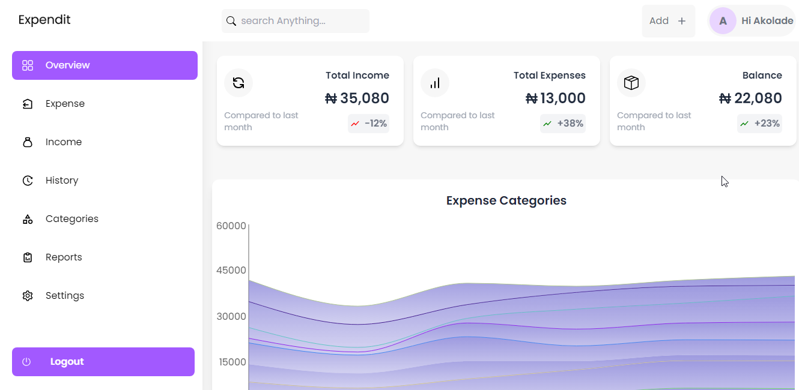

# Overview

Welcome to the Overview page of our Expense Tracker web app! This page provides a comprehensive snapshot of your financial activities, making it easy for you to manage and monitor your expenses effortlessly.

## Navbar

The top section of the page features a user-friendly navigation bar. On the right side, you'll find your user avatar, providing quick access to the Settings page for personalization. Additionally, there's a convenient search input to help you find specific transactions efficiently.

## Summary Section

Directly below the navbar is a summary section that gives you a quick overview of your financial status.

- **Total Income:** Displays the sum of all your income transactions for the current month.
- **Total Expense:** Highlights the total amount spent for the current month.
- **Balance:** Indicates the remaining balance after deducting expenses from income.

This section serves as a quick reference point for your overall financial health.

## Monthly Expenses Chart

To help you visualize your spending patterns, we provide an interactive line chart. This chart dynamically displays your current monthly expenses categorized for a comprehensive view. This visual representation empowers you to identify trends and make informed financial decisions.

## Latest Transactions

At the bottom of the page, you'll find a detailed list of your latest expense transactions. We understand the importance of staying up-to-date with your financial activities, so we display up to the four most recent transactions. Each entry includes essential details such as the transaction date, category, and amount spent.

This section ensures that you have a real-time overview of your spending history, helping you track your daily expenses efficiently.

Our Overview page is designed to be your go-to dashboard for managing your finances with ease. Whether you're keeping an eye on your budget, exploring spending trends, or reviewing recent transactions, this page provides the insights you need for a more informed financial journey. Enjoy using our Expense Tracker web app!
