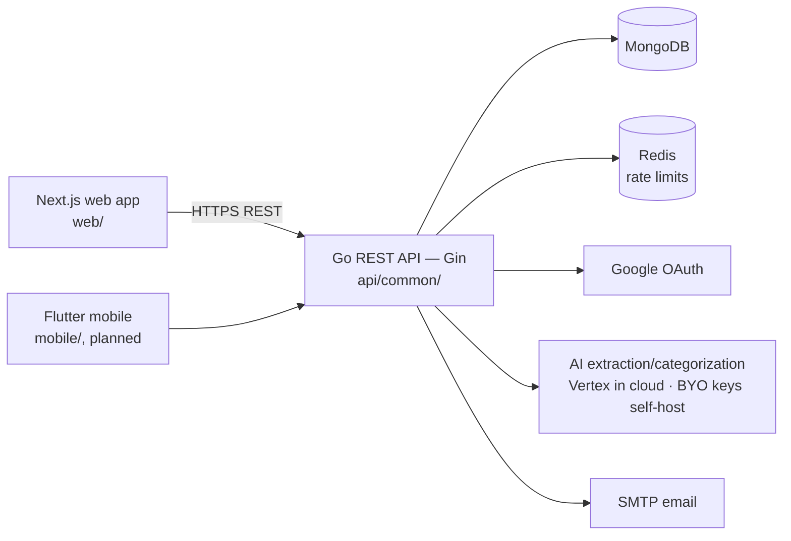

# Expendit

Expendit is an open-source application for estimating and tracking personal and
business expenses. Record expenses on the go, categorize them, import statements,
and generate real-time reports for better financial management.

[](./LICENSE)
[](https://github.com/cuesoftinc/expendit/actions/workflows/build-and-test.yml)

## Overview

Expendit is a monorepo containing the clients, backend services, deployment
configuration, and documentation for the platform. A Go REST API owns
authentication, expenses, income, categories, statement imports, AI-assisted
summaries, and reporting; a Next.js frontend serves the marketing site and the
authenticated dashboard; and a Flutter mobile app (planned) shares the same
API. For a deeper description of the components and how they fit together, see
[docs/overview.md](docs/overview.md).

## Architecture



### Tech stack

| Layer          | Technology                                             |
| -------------- | ------------------------------------------------------ |
| Backend API    | Go 1.26, Gin, MongoDB, JWT, Redis                      |
| Web            | Next.js, React, TypeScript                             |
| Mobile         | Flutter (planned)                                      |
| AI             | Google Gemini, Groq (summaries & categorization)       |
| Infrastructure | Docker, Helm, Terraform                                |

## Repository structure

```
api/
  common/      Go backend API (Gin, MongoDB) — module: github.com/cuesoftinc/expendit/api/common
web/           Next.js web application (marketing + dashboard)
mobile/
  flutter/     Flutter cross-platform app (planned)
  android/     Native Android (planned)
  ios/         Native iOS (planned)
deploy/
  docker/      Container / Docker Compose configuration
  helm/        Kubernetes Helm charts
  terraform/   Infrastructure as code
docs/          Architecture, setup, and reference documentation
scripts/       Developer and CI scripts
```

Additional services follow the same convention: `api/common` is the shared Go
backend, and every other service lives under `api/<service-name>` named by its
function (never by its language).

## Getting started

### Prerequisites

- [Docker](https://www.docker.com/) & Docker Compose (recommended path)
- For native development: [Go](https://go.dev/) 1.26, [Node.js](https://nodejs.org/) 24,
  and [MongoDB](https://www.mongodb.com/) + [Redis](https://redis.io/) (if not using Docker)

### Quick start

```bash
cp .env.example .env   # fill in secrets as needed
make up      # build + start the full stack (mongo, redis, api, web)
make logs    # follow logs
make down    # stop
```

The API listens on `http://localhost:8080` and the web app on
`http://localhost:3000` by default.

Run `make help` to see all available targets. For a detailed walkthrough, see
[docs/setup.md](./docs/setup.md).

> **Where this is heading:** the ratified target stack (Firebase Google-only auth, Aiven Postgres, Vertex AI, Cloud Run) lives in [docs/decisions.md](docs/decisions.md) — the diagram above is current state.

## Documentation
- [Hosted docs](https://cuesoft.gitbook.io/expendit) — the full documentation site (auto-synced from `docs/`)

Full documentation lives in the [`docs/`](./docs) folder:

- [Project overview](./docs/overview.md) — architecture and components
- [Local setup guide](./docs/setup.md) — step-by-step development environment

Service-specific notes live in each workspace: [`api/common/README.md`](./api/common/README.md)
and [`web/README.md`](./web/README.md).

## Contributing

We welcome contributions of all kinds — bug fixes, features, documentation, and
more. Please read the [Contribution Guide](./CONTRIBUTING.md) before opening a PR,
and note our [Code of Conduct](./CODE_OF_CONDUCT.md).

For first-time contributors, look for issues labelled
[`good first issue`](https://github.com/cuesoftinc/expendit/labels/good%20first%20issue).

## Security

Please report security vulnerabilities responsibly. See our
[Security Policy](./SECURITY.md) for how to report an issue privately.

## License

Expendit is open-source software licensed under the [MIT License](./LICENSE).
