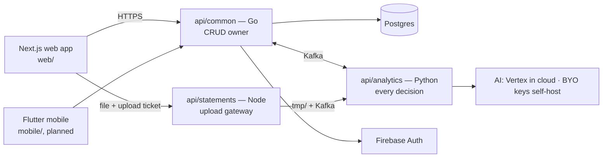

# Expendit

Expendit is an open-source application for estimating and tracking personal and
business expenses. Record expenses on the go, categorize them, import statements,
and generate real-time reports for better financial management.

[](./LICENSE)
[](https://github.com/cuesoftinc/expendit/actions/workflows/build-and-test.yml)

## Overview

Expendit is a monorepo containing the clients, backend services, deployment
configuration, and documentation for the platform. Three backend services
(Go for data, Node for uploads, Python for every financial decision) sit
behind one API host; a Next.js frontend serves the marketing site and the
authenticated dashboard; and a Flutter mobile app (planned) shares the same
API. For a deeper description of the components and how they fit together, see
[docs/overview.md](docs/overview.md).

## Architecture


```mermaid
flowchart LR
    WEB[Next.js web app<br/>web/] -->|HTTPS| COM[api/common — Go<br/>CRUD owner]
    WEB -->|file + upload ticket| ST[api/statements — Node<br/>upload gateway]
    MOB[Flutter mobile<br/>mobile/, planned] --> COM
    COM --> PG[(Postgres)]
    COM <-->|Kafka| AN[api/analytics — Python<br/>every decision]
    ST -->|tmp/ + Kafka| AN
    AN --> AI[AI: Vertex in cloud · BYO keys self-host]
    COM --> FB[Firebase Auth]
```

Go does CRUD, Python makes every decision, and the Node gateway validates
uploads and hands them off. The full design is
[docs/system-design.md](docs/system-design.md).

### Tech stack

| Layer          | Technology                                                       |
| -------------- | ---------------------------------------------------------------- |
| api/common     | Go 1.26, net/http, Postgres (pgx, row-level security), Redis     |
| api/statements | Node 24, NestJS 11                                               |
| api/analytics  | Python 3.12, FastAPI, aiokafka                                   |
| Messaging      | Kafka (Aiven), JSON Schema contract in `api/common/contract/`    |
| Auth           | Firebase, Google sign-in only                                    |
| Web            | Next.js, React, TypeScript                                       |
| Mobile         | Flutter (planned)                                                |
| AI             | Vertex AI in cloud; Groq or Gemini keys for self-host            |
| Infrastructure | Docker Compose, Helm, Terraform                                  |

## Repository structure

```
api/
  common/       Go CRUD owner: auth, orgs, ledger, imports, tickets, outbox (Postgres)
  statements/   Node upload gateway (POST /api/v1/uploads)
  analytics/    Python processing: extract pool + compute pool
web/            Next.js web application (marketing + dashboard)
mobile/
  flutter/      Flutter cross-platform app (planned)
  android/      Native Android (planned)
  ios/          Native iOS (planned)
deploy/
  docker/       Compose support files (Postgres init, Kafka topics, Firebase emulator)
  helm/         Kubernetes Helm chart (all services + sweeps)
  terraform/    Infrastructure as code
docs/           Architecture, setup, and reference documentation
scripts/        Developer and CI scripts
```

Every backend service lives under `api/<service-name>`, named by its
function (never by its language), and shares one base layout (config,
health, kafka, storage, contract, telemetry).

## Getting started

### Prerequisites

- [Docker](https://www.docker.com/) & Docker Compose (recommended path)
- For native development: [Go](https://go.dev/) 1.26, [Node.js](https://nodejs.org/) 24,
  [Python](https://www.python.org/) 3.12 (compose provides Postgres, Kafka, Redis and MinIO)

### Quick start

```bash
cp .env.example .env   # ships a local-only upload-ticket key pair
make up      # build + start the full stack (postgres, kafka, redis, minio, firebase emulator, 3 APIs, web)
make logs    # follow logs
make down    # stop
```

The API listens on `http://localhost:8080`, the upload gateway on `:8081`
and the web app on `http://localhost:3000`.

Run `make help` to see all available targets. For a detailed walkthrough, see
[docs/setup.md](./docs/setup.md).


## Documentation
- [Hosted docs](https://cuesoft.gitbook.io/expendit) — the full documentation site (auto-synced from `docs/`)

Full documentation lives in the [`docs/`](./docs) folder:

- [Project overview](./docs/overview.md) — architecture and components
- [Local setup guide](./docs/setup.md) — step-by-step development environment

Service-specific notes live in each workspace: [`api/common/README.md`](./api/common/README.md)
and [`web/README.md`](./web/README.md).

## Contributing

We welcome contributions of all kinds — bug fixes, features, documentation, and
more. Please read the [Contribution Guide](./CONTRIBUTING.md) before opening a PR,
and note our [Code of Conduct](./CODE_OF_CONDUCT.md).

For first-time contributors, look for issues labelled
[`good first issue`](https://github.com/cuesoftinc/expendit/labels/good%20first%20issue).

## Security

Please report security vulnerabilities responsibly. See our
[Security Policy](./SECURITY.md) for how to report an issue privately.

## License

Expendit is open-source software licensed under the [MIT License](./LICENSE).
