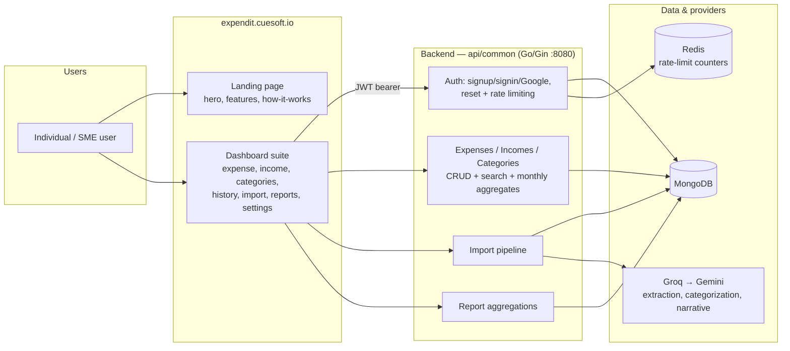
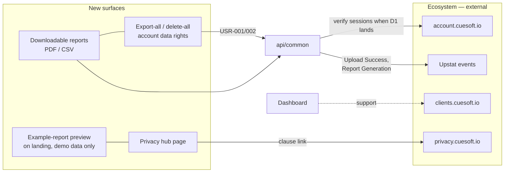
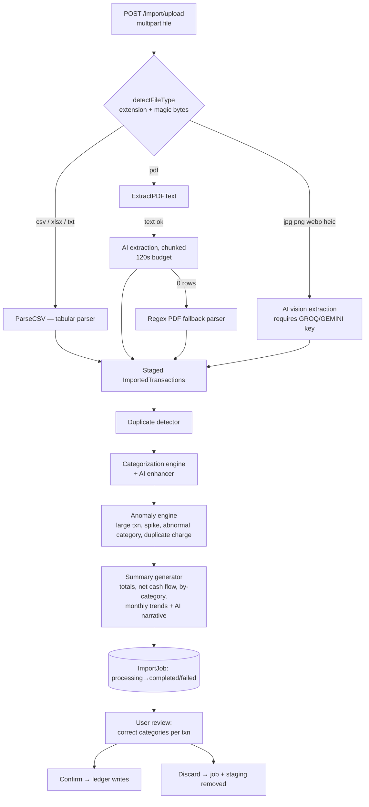
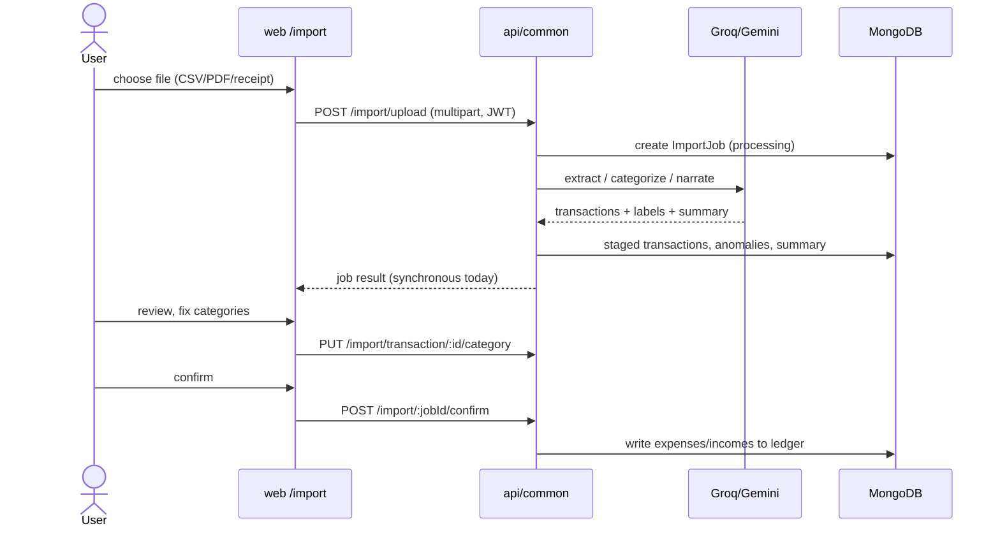
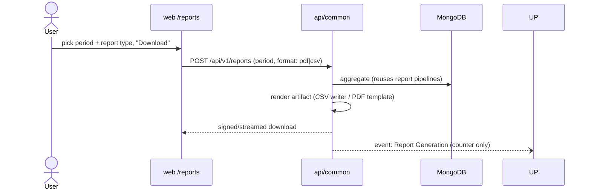
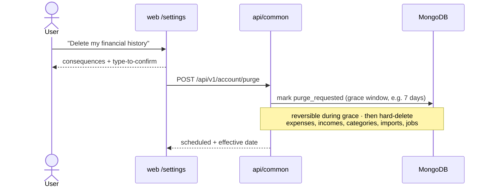
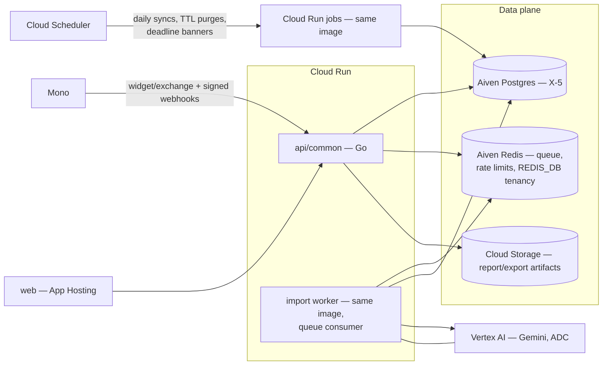

# Expendit — System Architecture

> Companion to [prd.md](prd.md). Markers: **[Current]**, **[PRD]**, **[Proposed]**.

## 1. Context — current state **[Current]**

The intelligence core is already here; what the PRD adds is drawn in §2.

## 2. Context — target additions **[PRD + Proposed]**

## 3. Service breakdown

### 3.1 api/common — the whole backend **[Current]**

| Area | Packages / files | Behaviour |
| --- | --- | --- |
| Auth | `handler/user_controller.go`, `middleware/{auth,rate_limit}` | JWT (HS256, signing-method-guarded), login + password-flow rate limits, Google auth, logout, change/forgot/reset password |
| Ledger | `handler/{expense,income,category}_controller.go` | Per-user CRUD + search; monthly aggregates (`/expense/expenses/month/:userID`, `/income/incomes/monthly/:userID`, …); identity enforced from JWT `uid` (not path params) |
| Import | `service/{import_service,csv_parser,pdf_parser,ai_enhancer,categorization_engine,duplicate_detector,anomaly_engine,summary_generator}.go` | See §4 |
| Reports | `handler/report_controller.go` | Mongo aggregations: monthly income-vs-expense (bar), by-category, category-expenses |

### 3.2 web — Next.js dashboard + landing **[Current]**

Routes: `/` (marketing sections), `/signin`, `/signup`, `/forgot-password[/new-password]`,
`/dashboard`, `/expense`, `/income`, `/categories`, `/history`, `/import`,
`/reports`, `/settings`, `/change-password`. Target adds: landing preview
section (EXP-001), `/privacy` (EXP-005), report-download UI (EXP-004),
data-rights controls in `/settings` (USR-001/002). **[Proposed placement]**

## 4. The import pipeline (core asset) **[Current]**

### 4.1 Flow

AI provider selection: `GROQ_API_KEY` → `GEMINI_API_KEY` → none (CSV/PDF regex
still work; image uploads error with guidance).

### 4.2 Known architectural debts **[Current → Proposed fixes]**

| Debt | Consequence | Proposed fix |
| --- | --- | --- |
| `ProcessImport` runs synchronously inside the upload request (AI budget alone up to 120s) | Slow requests, gateway timeouts on big statements, no horizontal isolation | Async job worker: upload returns `202 + jobId` immediately; worker consumes a Redis-backed queue; the `ImportJob.status` field already models this — Phase 2 roadmap |
| Raw file bytes are parsed in-memory and not persisted | Re-processing impossible; but privacy-friendly | Keep no-persistence as the *default* (privacy-first) and document it in the privacy hub; optional debug retention behind explicit consent **[Proposed]** |
| PDF text sampled into logs (`[pdf] sample: …`) | **Financial data in logs** — conflicts with §7 privacy stance | Remove/behind debug flag before privacy hub ships (roadmap P1 item) |
| Anomalies live only on the job | Not visible after leaving import screen | Anomaly feed/badges in dashboard (EXP-003 UX) |

## 5. Core sequences

### 5.1 Statement import — current **[Current]**

### 5.2 Downloadable report — target (EXP-004) **[Proposed]**

### 5.3 Delete-all data right — target (USR-002) **[Proposed]**

## 6. Deployment view **[Current]**

- Compose: mongo, redis, api-common :8080, web :3000 (healthcheck-gated).
- Helm: standard-form chart (api-common, web; `envFrom` secret hook; values
  document the external MongoDB/Redis requirement).
- Terraform: cluster-agnostic helm release.
- Target additions: worker deployment for async imports (same image,
  worker command) **[Proposed]**, no new stateful services.

## 7. Cross-repo dependencies

| ID | Dependency | Blocks |
| --- | --- | --- |
| D1 | `account.cuesoft.io` contract | ECO-AUTH migration (local JWT is the interim) |
| D2 | Upstat event-ingestion API | ECO-ANALYTICS events |
| D3 | Expendit clause on `privacy.cuesoft.io` | EXP-005 copy |

---

## 8. Target architecture (post-ratification: X-3/X-4/X-5, E-1) **[Decided]**

- **Scaling**: api/common 1 vCPU/512 MiB, concurrency 80, 0–5 instances;
  worker 1 vCPU/1 GiB, concurrency 1 (AI budget isolation), 0–3; jobs
  scheduled, min-instances 0 everywhere **[Decided defaults]**.
- **Security boundaries**: Mono tokens encrypted (KMS key via Doppler);
  webhooks signature-verified pre-processing; Vertex via service-account ADC
  (no keys); Postgres/Redis private-network + TLS (Aiven).
- **Failure branches for the §5 sequences**: report render failure →
  `500 internal`, artifact row not created, client retry; purge job crash →
  grace state persists, next scheduled run resumes (idempotent deletes);
  bank sequence failures per flows/bank-link.md §2.
