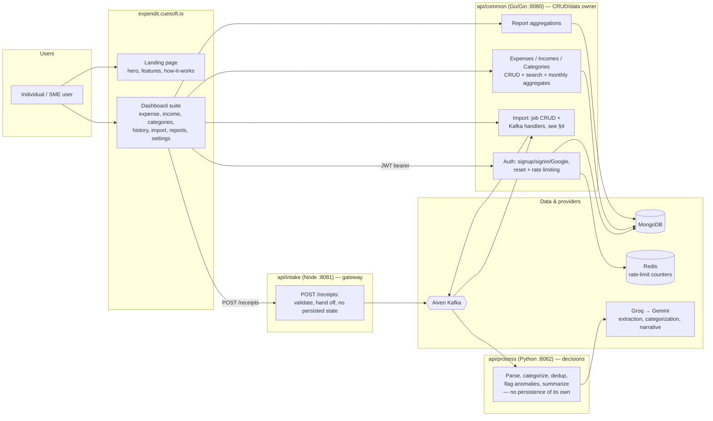
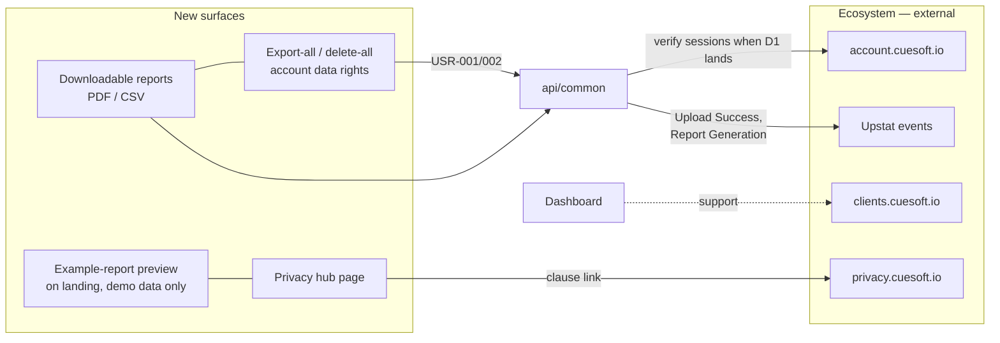
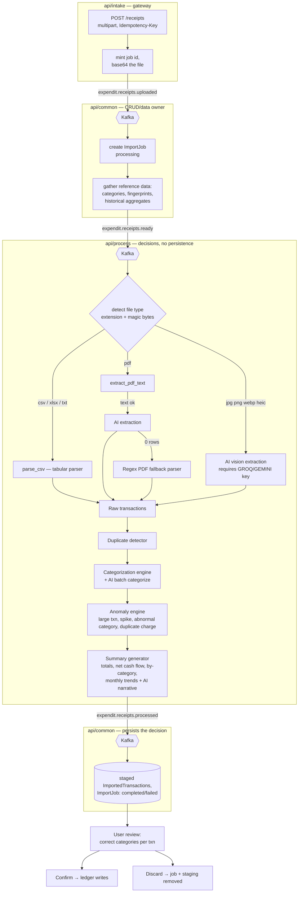
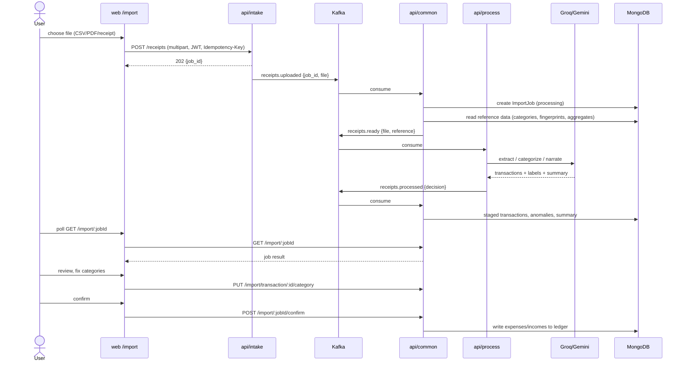
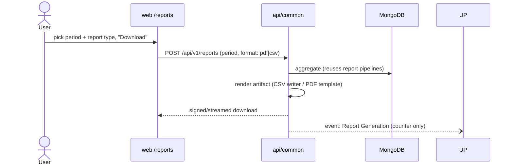
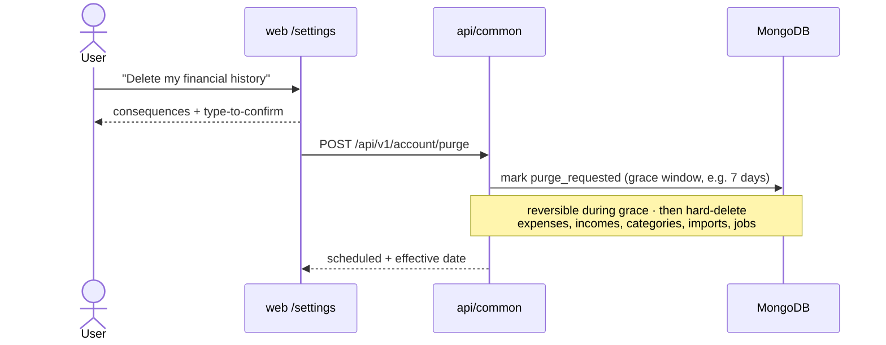
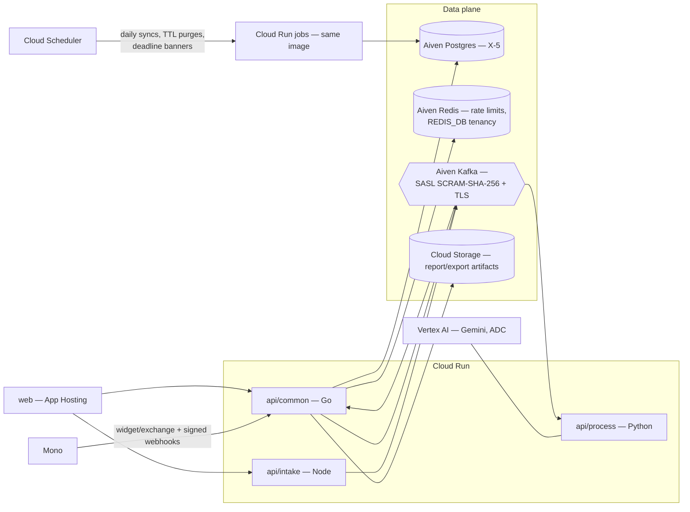

# Expendit — System Architecture

> Companion to [prd.md](prd.md). Markers: **[Current]**, **[PRD]**, **[Proposed]**.

## 1. Context — current state **[Current]**

```mermaid
flowchart LR
    subgraph Users
        U[Individual / SME user]
    end

    subgraph expendit.cuesoft.io
        LAND[Landing page<br/>hero, features, how-it-works]
        DASH[Dashboard suite<br/>expense, income, categories,<br/>history, import, reports, settings]
    end

    subgraph BE["api/common (Go/Gin :8080) — CRUD/data owner"]
        AUTH[Auth: signup/signin/Google,<br/>reset + rate limiting]
        LEDGER[Expenses / Incomes / Categories<br/>CRUD + search + monthly aggregates]
        IMPORTC[Import: job CRUD +<br/>Kafka handlers, see §4]
        REPORT[Report aggregations]
    end

    subgraph INTAKE["api/intake (Node :8081) — gateway"]
        UPLOAD[POST /receipts:<br/>validate, hand off, no persisted state]
    end

    subgraph PROCESS["api/process (Python :8082) — decisions"]
        DECIDE[Parse, categorize, dedup,<br/>flag anomalies, summarize<br/>— no persistence of its own]
    end

    subgraph Data & providers
        MG[(MongoDB)]
        RD[(Redis<br/>rate-limit counters)]
        KFK{{Aiven Kafka}}
        AI[Groq → Gemini<br/>extraction, categorization, narrative]
    end

    U --> LAND
    U --> DASH
    DASH -->|JWT bearer| AUTH
    DASH --> LEDGER
    DASH -->|POST /receipts| UPLOAD
    DASH --> IMPORTC
    DASH --> REPORT
    AUTH --> MG
    AUTH --> RD
    LEDGER --> MG
    UPLOAD --> KFK
    KFK --> IMPORTC
    IMPORTC --> KFK
    KFK --> DECIDE
    DECIDE --> AI
    REPORT --> MG
```

The intelligence core is already here; what the PRD adds is drawn in §2.

## 2. Context — target additions **[PRD + Proposed]**

```mermaid
flowchart LR
    subgraph New surfaces
        PREV[Example-report preview<br/>on landing, demo data only]
        PRIV[Privacy hub page]
        EXPORTS[Downloadable reports<br/>PDF / CSV]
        RIGHTS[Export-all / delete-all<br/>account data rights]
    end

    subgraph ECO["Ecosystem — external"]
        ACC[account.cuesoft.io]
        UP[Upstat events]
        CL[clients.cuesoft.io]
        PH[privacy.cuesoft.io]
    end

    PREV --- PRIV
    EXPORTS --- RIGHTS
    PRIV -->|clause link| PH
    RIGHTS -->|USR-001/002| API[api/common]
    EXPORTS --> API
    API -->|Upload Success,<br/>Report Generation| UP
    API -->|verify sessions when D1 lands| ACC
    DASHX[Dashboard] -.->|support| CL
```

## 3. Service breakdown

### 3.1 api/common — CRUD/data owner **[Current]**

| Area | Packages / files | Behaviour |
| --- | --- | --- |
| Auth | `handler/user_controller.go`, `middleware/{auth,rate_limit}` | JWT (HS256, signing-method-guarded), login + password-flow rate limits, Google auth, logout, change/forgot/reset password |
| Ledger | `handler/{expense,income,category}_controller.go` | Per-user CRUD + search; monthly aggregates (`/expense/expenses/month/:userID`, `/income/incomes/monthly/:userID`, …); identity enforced from JWT `uid` (not path params) |
| Import | `handler/import_controller.go` (job CRUD only) + `service/{import_service,import_pipeline}.go` | Kafka handlers that create the job, gather reference data, and persist `api/process`'s decisions — see §4. Never parses a file or makes a categorization/duplicate/anomaly decision |
| AI summary | `handler/ai_summary_controller.go`, `service/ai_enhancer.go` | Separate, pre-existing dashboard feature (`GET /ai/summary/:userID`, 3-month narrative) — unrelated to the import pipeline, kept in Go on purpose |
| Reports | `handler/report_controller.go` | Mongo aggregations: monthly income-vs-expense (bar), by-category, category-expenses |

### 3.2 api/intake — upload gateway **[Current]**

| Area | Files | Behaviour |
| --- | --- | --- |
| Upload | `src/receipts/{receipts.controller,receipts.service}.ts` | `POST /receipts`: JWT-guarded, 10 MB multipart cap, in-memory `Idempotency-Key` cache (single-instance only — a multi-replica deployment needs a shared store), mints the Mongo-ObjectID-hex job id `api/common` expects, publishes to Kafka, returns `202` immediately |
| Auth | `src/auth/jwt-auth.guard.ts` | Verifies the same HS256 JWT `api/common` issues (signature + expiry only) |

Owns no persisted state of its own — `api/common` is still the CRUD/data
owner for import jobs.

### 3.3 api/process — processing engine **[Current]**

| Area | Files | Behaviour |
| --- | --- | --- |
| Orchestration | `service/pipeline.py` | parse → categorize → dedup → flag anomalies → summarize, mirroring the old monolith's `ProcessImport` minus every persistence step |
| Parsing | `service/{csv_parser,pdf_parser}.py` | CSV/XLSX/TXT tabular parsing; PDF text extraction with AI extraction and a regex fallback |
| Decisions | `service/{categorization_engine,duplicate_detector,anomaly_engine}.py` | Categorization (+ AI batch categorize), duplicate detection against reference fingerprints, the 4 anomaly rules (flows/import.md §7) |
| AI | `service/ai_enhancer.py` | Groq → Gemini text/vision calls: PDF/image extraction, batch categorization, narrative summary |
| Summary | `service/summary_generator.py` | Totals, net cash flow, by-category, monthly trends — pure computation |
| Contracts | `model/schemas.py` | Pydantic Kafka message contracts shared with api/intake's TS interfaces and api/common's JSON tags |

`app/` holds only the FastAPI entrypoint (`app/main.py`) and typed config
(`app/config.py`); `router/`, `service/`, `model/`, and `kafka/` are
top-level siblings, per the Python layout in
repository-and-services.md. Consumes/produces only over Kafka
(`kafka/client.py`); imports no
database client — every decision travels back to `api/common` in the
outbound message.

### 3.4 web — Next.js dashboard + landing **[Current]**

Routes: `/` (pages.md Part A marketing home, incl. the EXP-001 demo-data
preview), `/signin` (Google-only, X-1), `/onboarding`, and the nested app
surface `/dashboard/<area>` — transactions, imports, accounts, reports,
company (+ statements/ratios), taxes (+ filing wizard), categories, and
settings incl. the USR-001/002 rights controls
(web-implementation.md §4 route map). Legacy flat paths (`/expense`,
`/income`, `/history`, `/import`, `/reports`, `/categories`, `/settings`,
`/signup`, `/forgot-password[/new-password]`, `/change-password`) carry no
redirect stubs — they 404 on the branded page. Target adds: `/privacy`
(EXP-005).
**[Proposed placement]**

## 4. The import pipeline (core asset) **[Current]**

### 4.1 Flow

Three services, connected by Aiven Kafka pub/sub instead of a direct call
(chosen because Cloud Run scale-to-zero can silently drop a live connection,
while a queue retains messages across a consumer restart — organization
policy's gRPC-s2s-resilience note):

```mermaid
flowchart TD
    subgraph "api/intake — gateway"
        UP[POST /receipts<br/>multipart, Idempotency-Key] --> MINT[mint job id,<br/>base64 the file]
    end

    MINT -->|expendit.receipts.uploaded| K1{{Kafka}}

    subgraph "api/common — CRUD/data owner"
        K1 --> CREATE[create ImportJob<br/>processing]
        CREATE --> REF[gather reference data:<br/>categories, fingerprints,<br/>historical aggregates]
    end

    REF -->|expendit.receipts.ready| K2{{Kafka}}

    subgraph "api/process — decisions, no persistence"
        K2 --> DET{detect file type<br/>extension + magic bytes}
        DET -->|csv / xlsx / txt| CSV[parse_csv — tabular parser]
        DET -->|pdf| PDFT[extract_pdf_text]
        PDFT -->|text ok| AIX[AI extraction]
        AIX -->|0 rows| RGX[Regex PDF fallback parser]
        DET -->|jpg png webp heic| VIS[AI vision extraction<br/>requires GROQ/GEMINI key]
        CSV --> RAW
        AIX --> RAW
        RGX --> RAW
        VIS --> RAW
        RAW[Raw transactions] --> DUP[Duplicate detector]
        DUP --> CAT[Categorization engine<br/>+ AI batch categorize]
        CAT --> ANOM[Anomaly engine<br/>large txn, spike, abnormal category, duplicate charge]
        ANOM --> SUM[Summary generator<br/>totals, net cash flow, by-category,<br/>monthly trends + AI narrative]
    end

    SUM -->|expendit.receipts.processed| K3{{Kafka}}

    subgraph "api/common — persists the decision"
        K3 --> PERSIST[(staged ImportedTransactions,<br/>ImportJob: completed/failed)]
    end

    PERSIST --> REVIEW[User review:<br/>correct categories per txn]
    REVIEW --> CONFIRM[Confirm → ledger writes]
    REVIEW --> DISCARD[Discard → job + staging removed]
```

AI provider selection: `GROQ_API_KEY` → `GEMINI_API_KEY` → none (CSV/PDF regex
still work; image uploads error with guidance).

The anomaly engine's four rule types have their computational contract
(formulas, v1 constants, severities) in flows/import.md §7 — a rules-as-data
registry like line-items.md §5.

### 4.2 Known architectural debts **[Current → Proposed fixes]**

| Debt | Consequence | Proposed fix |
| --- | --- | --- |
| `api/intake`'s idempotency cache and Kafka producer are in-process only | A multi-replica `api/intake` deployment loses idempotency guarantees and can drop messages queued at shutdown | Shared store (Redis) for the idempotency cache; drain producer on shutdown before exiting |
| `api/intake` enforces a 10 MB upload cap; flows/import.md §2 decided 15 MB | Code and the decided contract disagree | Ratify one value and make the other match — not yet reconciled |
| Raw file bytes are parsed in-memory and not persisted | Re-processing impossible; but privacy-friendly | Keep no-persistence as the *default* (privacy-first) and document it in the privacy hub; optional debug retention behind explicit consent **[Proposed]** |
| Anomalies live only on the job | Not visible after leaving import screen | Anomaly feed/badges in dashboard (EXP-003 UX) |

The old monolith's `[pdf] sample: …` log line (financial data in logs) did
**not** carry over to `api/process/service/pdf_parser.py` during the
migration — resolved, not carried forward as a debt.

## 5. Core sequences

### 5.1 Statement import — current **[Current]**

```mermaid
sequenceDiagram
    actor U as User
    participant W as web /import
    participant I as api/intake
    participant K as Kafka
    participant A as api/common
    participant P as api/process
    participant AI as Groq/Gemini
    participant M as MongoDB

    U->>W: choose file (CSV/PDF/receipt)
    W->>I: POST /receipts (multipart, JWT, Idempotency-Key)
    I-->>W: 202 {job_id}
    I->>K: receipts.uploaded {job_id, file}
    K->>A: consume
    A->>M: create ImportJob (processing)
    A->>M: read reference data (categories, fingerprints, aggregates)
    A->>K: receipts.ready {file, reference}
    K->>P: consume
    P->>AI: extract / categorize / narrate
    AI-->>P: transactions + labels + summary
    P->>K: receipts.processed {decision}
    K->>A: consume
    A->>M: staged transactions, anomalies, summary
    U->>W: poll GET /import/:jobId
    W->>A: GET /import/:jobId
    A-->>W: job result
    U->>W: review, fix categories
    W->>A: PUT /import/transaction/:id/category
    U->>W: confirm
    W->>A: POST /import/:jobId/confirm
    A->>M: write expenses/incomes to ledger
```

### 5.2 Downloadable report — target (EXP-004) **[Proposed]**

```mermaid
sequenceDiagram
    actor U as User
    participant W as web /reports
    participant A as api/common
    participant M as MongoDB

    U->>W: pick period + report type, "Download"
    W->>A: POST /api/v1/reports (period, format: pdf|csv)
    A->>M: aggregate (reuses report pipelines)
    A->>A: render artifact (CSV writer / PDF template)
    A-->>W: signed/streamed download
    A--)UP: event: Report Generation (counter only)
```

### 5.3 Delete-all data right — target (USR-002) **[Proposed]**

```mermaid
sequenceDiagram
    actor U as User
    participant W as web /settings
    participant A as api/common
    participant M as MongoDB

    U->>W: "Delete my financial history"
    W-->>U: consequences + type-to-confirm
    W->>A: POST /api/v1/account/purge
    A->>M: mark purge_requested (grace window, e.g. 7 days)
    Note over A,M: reversible during grace · then hard-delete<br/>expenses, incomes, categories, imports, jobs
    A-->>W: scheduled + effective date
```

## 6. Deployment view **[Current]**

- Compose: mongo, redis, api-common :8080, api-intake :8081, api-process
  :8082, web :3000 (healthcheck-gated). Kafka itself is never run in
  compose — `KAFKA_BROKERS` unset disables the consumers/producer on all
  three services (documented no-op posture), so the stack still runs
  without Aiven Kafka configured.
- Helm: standard-form chart (api-common, api-intake, api-process, web;
  `envFrom` secret hook; values document the external MongoDB/Redis/Kafka
  requirement).
- Terraform: cluster-agnostic helm release.

## 7. Cross-repo dependencies

| ID | Dependency | Blocks |
| --- | --- | --- |
| D1 | `account.cuesoft.io` contract | ECO-AUTH migration (local JWT is the interim) |
| D2 | Upstat event-ingestion API | ECO-ANALYTICS events |
| D3 | Expendit clause on `privacy.cuesoft.io` | EXP-005 copy |

---

## 8. Target architecture (post-ratification: X-3/X-4/X-5, E-1) **[Decided]**

```mermaid
flowchart LR
    subgraph Cloud Run
        API[api/common — Go]
        INTAKE[api/intake — Node]
        PROC[api/process — Python]
    end
    subgraph Data plane
        PG[(Aiven Postgres — X-5)]
        RD[(Aiven Redis — rate limits,<br/>REDIS_DB tenancy)]
        KFK{{Aiven Kafka —<br/>SASL SCRAM-SHA-256 + TLS}}
        CS[(Cloud Storage — report/export artifacts)]
    end
    MONO[Mono] -->|widget/exchange + signed webhooks| API
    VX[Vertex AI — Gemini, ADC] --- PROC
    WEB[web — App Hosting] --> API
    WEB --> INTAKE
    INTAKE --> KFK
    KFK --> API
    API --> KFK
    KFK --> PROC
    API --> PG
    API --> RD
    API --> CS
    SCHED[Cloud Scheduler] -->|daily syncs, TTL purges,<br/>deadline banners| JOBS[Cloud Run jobs — same image]
    JOBS --> PG
```

Supersedes the earlier same-image worker/Redis-queue sketch: the ratified
pub/sub standard (organization-policy.md) makes `api/intake` → `api/process`
→ `api/common` over Kafka the actual shape, already built and running in
compose/Helm today (self-host) ahead of this Cloud Run target.

- **Scaling**: api/common 1 vCPU/512 MiB, concurrency 80, 0–5 instances
  **[Decided defaults]**; `api/intake`/`api/process` Cloud Run sizing isn't
  ratified yet **[Proposed]** — `api/process` needs concurrency isolated
  from its AI call budget the way the old worker row did; jobs scheduled,
  min-instances 0 everywhere.
- **Security boundaries**: Mono tokens encrypted (KMS key via Doppler);
  webhooks signature-verified pre-processing; Vertex via service-account ADC
  (no keys); Postgres/Redis private-network + TLS (Aiven); Kafka
  SASL SCRAM-SHA-256 + TLS (verified against a live Aiven instance,
  2026-09-16 — organization-policy.md's pub/sub note).
- **Failure branches for the §5 sequences**: report render failure →
  `500 internal`, artifact row not created, client retry; purge job crash →
  grace state persists, next scheduled run resumes (idempotent deletes);
  bank sequence failures per flows/bank-link.md §2.
