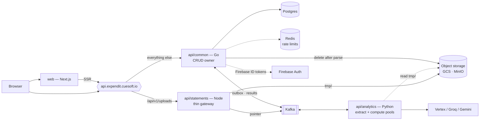
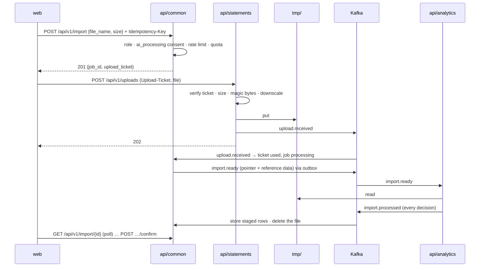
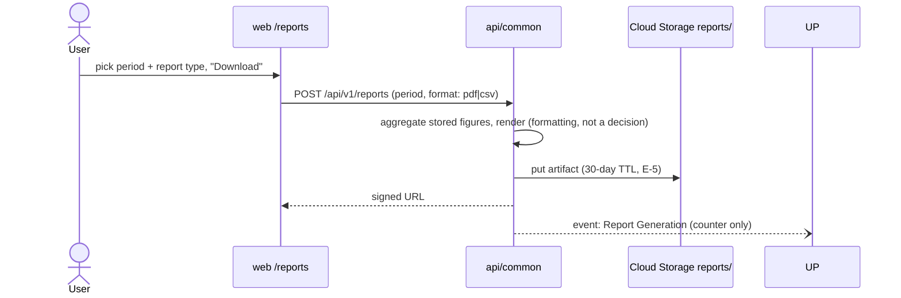

# Expendit — System Architecture

> Companion to [prd.md](prd.md). **Rewritten 2026-10-05** from the ratified
> [system design](system-design.md) (S-1…S-14), which holds the rationale,
> failure modes and migration plan. This page describes the system as built.
> Markers: **[Built]** exists in the code, **[Planned]** has a phase but no
> code yet.

## 1. Context **[Built]**

```mermaid
flowchart LR
    BR[Browser] --> WEB[web — Next.js]
    BR --> LB{{api.expendit.cuesoft.io}}
    WEB -->|SSR| LB
    LB -->|/api/v1/uploads| ST[api/statements — Node<br/>thin gateway]
    LB -->|everything else| CM[api/common — Go<br/>CRUD owner]
    CM --> PG[(Postgres)]
    CM -.-> R[(Redis<br/>rate limits)]
    ST -->|tmp/| OS[(Object storage<br/>GCS · MinIO)]
    AN -.->|read tmp/| OS
    CM -->|delete after parse| OS
    ST -->|pointer| K[[Kafka]]
    CM <-->|outbox · results| K
    K <--> AN[api/analytics — Python<br/>extract + compute pools]
    AN --> AI[Vertex / Groq / Gemini]
    CM -.->|Firebase ID tokens| FB[Firebase Auth]
```

The language rule (CueLABS standard): **Go does CRUD only, Python does
every decision, the Node gateway validates and hands off.**

## 2. Services

| Unit | Lang | Role | Owns | Port |
| --- | --- | --- | --- | --- |
| `web` | Next.js | Landing + dashboard. TEST_MODE runs against the in-app mock API, which is the HTTP contract (system-design.md §7.3). | — | 3000 |
| `api/common` | Go | Auth (Firebase), orgs and roles, ledger, imports and staging, statements, stored ratios and tax figures, upload tickets, transactional outbox, sweeps. | **Postgres (sole client)** | 8080 |
| `api/statements` | Node (NestJS 11) | `POST /api/v1/uploads`: verifies the upload ticket, checks size and magic bytes, downscales receipt images, writes `tmp/`, publishes a pointer. | nothing | 8081 |
| `api/analytics` | Python (FastAPI) | `extract` pool: parsing, AI extraction, duplicates, categories, anomalies, summaries, statement row mapping. `compute` pool: statement derivations and checks, ratios, PIT/CIT/VAT, dashboard summary. | nothing | 8082 |

### 2.1 The shared base layout **[Built]**

Every service starts from the same base, then branches into its own
packages (system-design.md §16 I-1):

| Base | `api/common` (Go) | `api/statements` (Node) | `api/analytics` (Python) |
| --- | --- | --- | --- |
| entry | `cmd/server`, `cmd/jobs` | `src/main.ts` | `app/main.py` |
| typed config, fail-fast | `internal/config` | `src/config` | `app/config.py` |
| `/health`, `/ready` | `internal/router` | `src/health` | `health/` |
| Kafka transport | `internal/kafka` | `src/kafka` | `kafka/` |
| object storage (`gcs` \| `s3`) | `internal/storage` | `src/storage` | `storage/` |
| schema validation | `internal/kafka/contract.go` | `src/contract` | `contract/` |
| JSON logs | `log/slog` | `src/telemetry` | `telemetry/` |
| **its own** | `handler`, `middleware`, `service`, `repository`, `model`, `ticket`, `outbox`, `ratelimit`, `sweep`, `migrations/`, `contract/` | `ticket`, `filetype`, `upload`, `errors` | `extract/{parse,dedup,categorize,anomaly,summary,mapping,ai}`, `compute/{registry,derive,ratios,tax,summary}` |

Each service's README has its full layout.

## 3. Data **[Built]**

- **Postgres** is read and written only by `api/common` (S-2). Schema:
  `api/common/migrations/`. Every org-scoped table has forced row-level
  security on `org_id` (S-11), and the app connects as a non-superuser.
- **Object storage**: `expendit/<env>/tmp/` holds uploads until parsed
  (S-4); `compute/` holds oversized message payloads (S-3).
  `reports/` and `exports/` are **[Planned]**.
- **Kafka** carries every hand-off, with no synchronous service-to-service
  calls (D4). The eight topics and their JSON Schemas are in
  `api/common/contract/`.
- **Redis** holds rate-limit and quota counters only, and fails open (§9.2).

Entity details: [data-model.md](data-model.md). Topic table:
[system-design.md §5.3](system-design.md#53-kafka-topics).

## 4. The import pipeline **[Built]**

```mermaid
sequenceDiagram
    participant W as web
    participant C as api/common
    participant G as api/statements
    participant S as tmp/
    participant K as Kafka
    participant P as api/analytics

    W->>C: POST /api/v1/import {file_name, size} + Idempotency-Key
    C->>C: role · ai_processing consent · rate limit · quota
    C-->>W: 201 {job_id, upload_ticket}
    W->>G: POST /api/v1/uploads (Upload-Ticket, file)
    G->>G: verify ticket · size · magic bytes · downscale
    G->>S: put
    G->>K: upload.received
    G-->>W: 202
    K->>C: upload.received → ticket used, job processing
    C->>K: import.ready (pointer + reference data) via outbox
    K->>P: import.ready
    P->>S: read
    P->>K: import.processed (every decision)
    K->>C: store staged rows · delete the file
    W->>C: GET /api/v1/import/{id} (poll) … POST …/confirm
```

Company statements take the same path into `statement.ready` →
`statement.mapped`. Mapping edits and every number that isn't a plain sum go
through `compute.requested` → `compute.results` (system-design.md §6.4,
§6.5). Behavioural contracts: [flows/import.md](flows/import.md),
[flows/statement-mapping.md](flows/statement-mapping.md).

## 5. Target sequences **[Planned]**

### 5.1 Downloadable report (EXP-004)

```mermaid
sequenceDiagram
    actor U as User
    participant W as web /reports
    participant C as api/common
    participant S as Cloud Storage reports/

    U->>W: pick period + report type, "Download"
    W->>C: POST /api/v1/reports (period, format: pdf|csv)
    C->>C: aggregate stored figures, render (formatting, not a decision)
    C->>S: put artifact (30-day TTL, E-5)
    C-->>W: signed URL
    C--)UP: event: Report Generation (counter only)
```

### 5.2 Delete-all data right (USR-002)

```mermaid
sequenceDiagram
    actor U as User
    participant W as web /settings
    participant C as api/common

    U->>W: "Delete my financial history"
    W-->>U: consequences + type-to-confirm
    W->>C: POST /api/v1/account/purge
    C->>C: purge_request (7-day grace, E-5)
    Note over C: reversible during grace; then the daily sweep hard-deletes
    C-->>W: scheduled + effective date
```

### 5.3 Bank linking (E-1, phase C)

Mono widget exchange, KMS-encrypted tokens, the daily sync sweep and
webhooks, all in `api/common` (S-9). Fetched rows enter the import pipeline
as `import.ready {source: bank_sync, rows}`, which `api/analytics` already
handles. See system-design.md §6.2 and [flows/bank-link.md](flows/bank-link.md).

## 6. Deployment view

See [deployment.md](deployment.md). In short: Cloud Run services for
`common` (min 1) and `statements`, worker pools for `analytics`, Cloud Run
jobs for the sweeps, Firebase App Hosting for `web`, Aiven for Postgres,
Kafka and Redis. Compose and the Helm chart run the same images.

## 7. Cross-repo dependencies

| ID | Dependency | Blocks |
| --- | --- | --- |
| D1 | `account.cuesoft.io` facade over the same Firebase project | nothing (Firebase is already the auth, X-1) |
| D2 | Upstat event-ingestion API and OTLP receiver | product events, OTel export (X-9) |
| D3 | Expendit clause on `privacy.cuesoft.io` | EXP-005 copy; must reflect S-4 |
