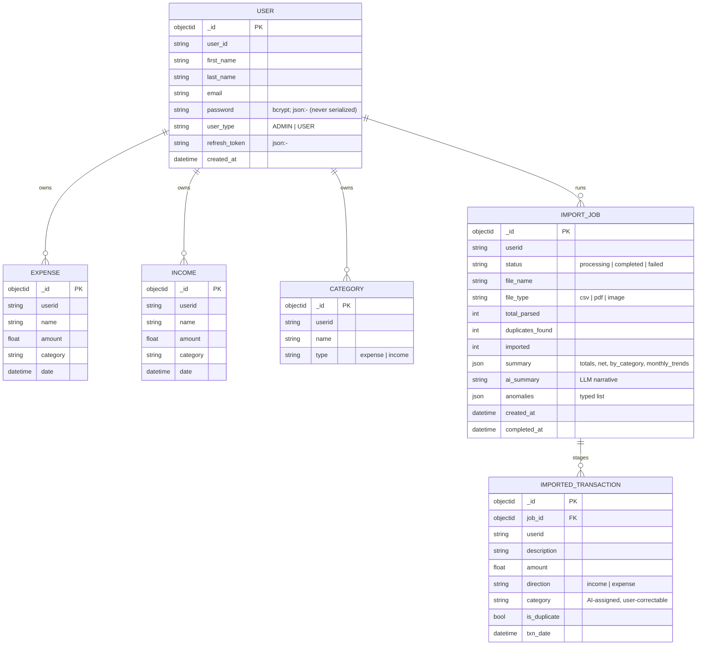
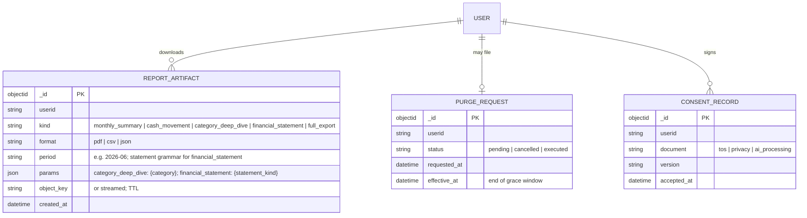

# Expendit — Data Model

> Companion to [prd.md](prd.md) / [architecture.md](architecture.md).
> Markers: **[Current]**, **[PRD]**, **[Proposed]**.

> **X-5 alignment (2026-07-16):** cloud system of record is **Aiven
> Postgres**; the Mongo entities below describe the *current* code and the
> self-host default until the Mongo→Postgres migration executes with E-4.
> Entity shapes are store-agnostic.

## 1. Current entities **[Current]** (MongoDB)

Notes:

- Field names above are representative of the Go structs in
  `internal/model/`; `password`/`refresh_token` are excluded from all JSON
  responses (`json:"-"`).
- Anomaly vocabulary **[Current]**: `large_transaction`, `spending_spike`,
  `abnormal_category`, `duplicate_charge`. Computational contract (formulas,
  v1 constants, severities): flows/import.md §7.
- Raw uploaded file bytes are **not persisted** — parsed in-memory only.
  This is a privacy feature to keep, and to document (prd.md §8.3).

## 2. Target additions **[Proposed]**

- `REPORT_ARTIFACT` backs EXP-004 (downloadables) and USR-001 (full export is
  just `kind: full_export`).
- `PURGE_REQUEST` backs USR-002 with a grace window (architecture.md §5.3).
- `CONSENT_RECORD` mirrors apparule's model for ecosystem parity; the
  `ai_processing` document records acceptance of third-party AI extraction
  (prd.md §6, open question 1).

## 3. Identity mapping (X-1 hardened — Firebase, Google-only) **[Decided]**

`USER` gains a `firebase_uid` column (unique). First Google sign-in
links-by-verified-email or creates the row (flows/auth.md §3 is the
normative flow: 60-day legacy window, then `410 migrate_to_firebase`;
password fields dropped after the window). Every owned collection keeps its
`userid` scoping untouched. The future `account.cuesoft.io` facade fronts
the same Firebase project — no further migration.

## 4. Data classification & handling **[PRD §5/§7]**

| Class | Data | Rules |
| --- | --- | --- |
| High-sensitivity | Transactions (all), import staging, summaries, AI narratives, uploaded file bytes (in flight), tax identity & location (`tin`, `rc_number`, `nin`, `state_of_residence`, `registered_address` — X-10 tier-1/tier-2 fields, §5) | Never in logs (the current `[pdf] sample:` log line must go — architecture.md §4.2); TLS in transit; third-party AI processing disclosed; raw files not at rest |
| Sensitive | User identity, consent, purge requests | Standard PII handling; consent/purge rows immutable audit records |
| Operational | Job status/counters, event counters to Upstat | Safe for logs/metrics; Upstat events are **counters only, never amounts or descriptions** |

Retention defaults **[Proposed, to ratify]**: ledger data until user deletion
(USR-002); import jobs + staging 90 days after confirm/discard; report
artifacts 30 days (regenerable); raw uploads never at rest.

---

## 5. Expansion entities (2026-07-16) **[Proposed]**

```mermaid
erDiagram
    USER ||--o{ ORG_MEMBER : "belongs to"
    ORG ||--o{ ORG_MEMBER : has
    ORG ||--o{ BANK_LINK : links
    BANK_LINK ||--o{ BANK_SYNC : "runs"
    ORG ||--o{ FIN_STATEMENT : uploads
    FIN_STATEMENT ||--o{ LINE_ITEM : "normalized into"
    ORG ||--o{ RATIO_REPORT : computes
    ORG ||--o{ TAX_PROFILE : configures
    TAX_PROFILE ||--o{ TAX_ESTIMATE : produces
    TAX_PROFILE ||--o{ TAX_FILING : files

    ORG { objectid _id PK
        string name
        string kind "personal | company"
        string currency
        string country
        string fiscal_year_end "MM-DD, default 12-31 — defines FYYYYY periods (line-items.md §6)"
        json registered_address "company orgs: {line1, line2?, city, state, country} — state required (CIT/VAT authority, tax-engine.md §5.5); high-sensitivity (§4)" }
    BANK_LINK { objectid _id PK
        objectid org_id FK
        string provider "mono (E-1 ratified); plaid later"
        string institution
        string masked_account
        string provider_token_enc "encrypted at rest; never serialized/logged"
        string sync_cursor "provider transaction cursor; advances only past processed txns"
        string status "pending|active|reauth_required|degraded|paused"
        datetime last_synced_at }
    BANK_SYNC { objectid _id PK
        objectid link_id FK
        objectid import_job_id FK
        string cursor_before
        string cursor_after
        string status "running|completed|failed"
        datetime started_at }
    ORG_MEMBER { objectid org_id FK
        objectid user_id FK
        string role "owner|admin|member"
        datetime joined_at }
    TAX_PROFILE { objectid _id PK
        objectid org_id FK
        string jurisdiction "NG"
        string taxpayer_kind "individual|company"
        string tin "optional until filing (422 tax_identity_incomplete)"
        string state_of_residence "NG state code; required for individual profiles — resolves the PIT State IRS (tax-engine.md §5.5); high-sensitivity (§4)"
        string rc_number "company; optional until filing; high-sensitivity (§4)"
        string nin "individual; optional; high-sensitivity (§4)"
        json category_treatments "category → tax_treatment + vat_treatment + vat_basis" }
    TAX_ESTIMATE { objectid _id PK
        objectid profile_id FK
        string kind "pit|cit|vat"
        string period
        json computed_fields "with input traces"
        json authority "resolved remittance authority {code, name} — tax-engine.md §5.5"
        string ruleset_id
        datetime computed_at }
    FIN_STATEMENT { objectid _id PK
        objectid org_id FK
        string kind "balance_sheet|income_statement|cash_flow"
        string period "closed grammar (line-items.md §6): YYYY-Qn | YYYY-H1/H2 | FYYYYY"
        string source_file_type "csv|xlsx|pdf|image|manual"
        string mapping_status "processing|staged|confirmed|failed|superseded (flows/statement-mapping.md §4)"
        objectid superseded_by FK "nullable — the replacement statement (audit trail)" }
    LINE_ITEM { objectid _id PK
        objectid statement_id FK
        string canonical_key "current_assets|inventory|long_term_debt|revenue|cogs|net_income|..."
        string source_label "as it appeared in the upload"
        float amount
        string status "mapped|unmapped (parked rows excluded from ratios)"
        float confidence "nullable — AI suggestion confidence 0-1"
        string mapped_by "ai|user" }
    RATIO_REPORT { objectid _id PK
        objectid org_id FK
        string period
        json ratios "key → {value, formula, inputs[line_item ids], benchmark_band}"
        datetime computed_at }
    TAX_FILING { objectid _id PK
        objectid org_id FK
        string kind "pit|cit|vat"
        string period
        string status "draft|generated|submitted|accepted"
        json computed_fields "each with input trace"
        json authority "resolved remittance authority {code, name} — immutable once generated"
        string artifact_key "generated forms incl. remittance sheet"
        datetime filed_at }
```

Notes: existing per-user collections become org-scoped (`org_id`) with a
personal org auto-created per user (migration: `userid` → personal org). The
`canonical_key` vocabulary is the closed mapping target for AI-suggested
line mapping (pages.md B6) — same schema-as-boundary pattern as elsewhere.
Ratio formulas persist **with their inputs** so every gauge is auditable
(MI-8 trace). Tax computed fields carry input traces for the wizard's
"how we got this" expanders; filings are immutable once submitted.
Bank credentials are never stored — only provider tokens, encrypted, with
provider-side revocation honored (BNK-002 unlink offers keep-or-purge for
already-imported transactions).

**Who uses which org kind [Decided 2026-07-16]:** individuals and
unincorporated freelancers use their auto-created **personal org** (ledger
capture, imports, PIT — no financial statements); any business entity that
wants statement capture / ratios / CIT creates a **company org regardless of
incorporation status**, with `TAX_PROFILE.taxpayer_kind`
(`individual | company`) deciding PIT-vs-CIT treatment (tax-engine.md §2's
freelancer limitation applies to gross-income PIT either way).
Cross-referenced from pages.md B6's empty state and prd.md §2. Estimates and
filings persist their resolved remittance authority (tax-engine.md §5.5) so
historical records survive registry changes.

---

## 6. Review additions (2026-07-16)

### 6.1 Import-job provenance

`IMPORT_JOB` gains `source: upload | bank_sync` and staged/ledger
transactions gain `source_link_id` (nullable) — the column the unlink
`purge=true` path deletes by (flows/bank-link.md §3).

### 6.2 BANK_LINK state transitions

`pending` (widget opened) → `active` (exchange OK) | purged after 1h ·
`active` → `reauth_required` (provider revocation) | `degraded` (3
consecutive sync failures; resets on first success) | `paused` (user) ·
`reauth_required/degraded/paused` → `active` (re-auth / success / resume).

### 6.3 Mongo→Postgres + org migration runbook (E-4/X-5, "one migration")

1. **Freeze window** (not dual-write **[Decided]** — volumes allow a short
   freeze): announce in-app 48h ahead; writes disabled ≤ 30 min.
2. Schema pre-created in Aiven PG (this doc's entities as DDL).
3. Copy with transform: `userid` scoping → auto-created personal `ORG` per
   user + `ORG_MEMBER(owner)` rows; checksums per table.
4. **Parity harness**: row counts + per-table content checksums + 20 sampled
   golden users compared field-by-field; abort on any mismatch.
5. Cutover: deploy PG-backed release (tag), unfreeze; Mongo kept read-only
   **30 days** as the rollback artifact (rollback = redeploy previous tag,
   un-freeze Mongo), then decommissioned.
6. Self-host: compose ships a migration job container with the same steps.
