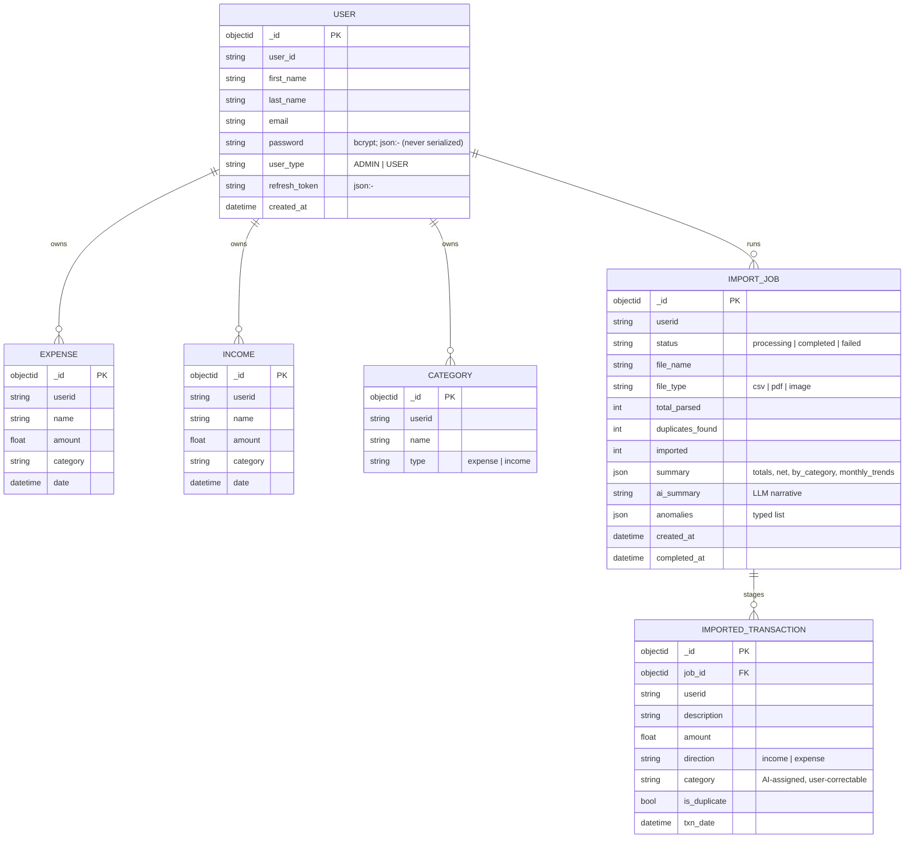
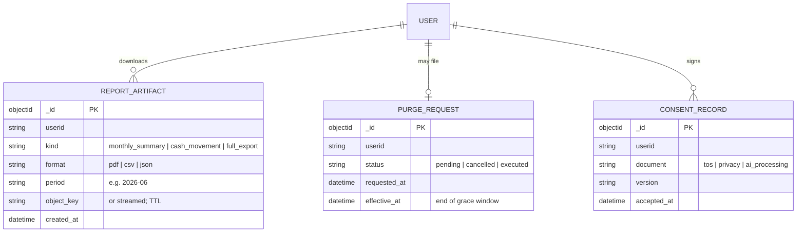
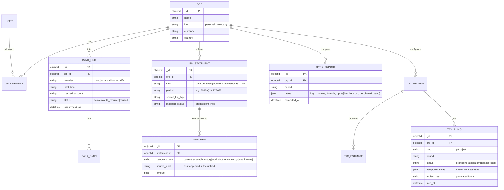

# Expendit — Data Model

> Companion to [prd.md](prd.md) / [architecture.md](architecture.md).
> Markers: **[Current]**, **[PRD]**, **[Proposed]**.

> **X-5 alignment (2026-07-16):** cloud system of record is **Aiven
> Postgres**; the Mongo entities below describe the *current* code and the
> self-host default until the Mongo→Postgres migration executes with E-4.
> Entity shapes are store-agnostic.

## 1. Current entities **[Current]** (MongoDB)

Notes:

- Field names above are representative of the Go structs in
  `internal/model/`; `password`/`refresh_token` are excluded from all JSON
  responses (`json:"-"`).
- Anomaly vocabulary **[Current]**: `large_transaction`, `spending_spike`,
  `abnormal_category`, `duplicate_charge`.
- Raw uploaded file bytes are **not persisted** — parsed in-memory only.
  This is a privacy feature to keep, and to document (prd.md §8.3).

## 2. Target additions **[Proposed]**

- `REPORT_ARTIFACT` backs EXP-004 (downloadables) and USR-001 (full export is
  just `kind: full_export`).
- `PURGE_REQUEST` backs USR-002 with a grace window (architecture.md §5.3).
- `CONSENT_RECORD` mirrors apparule's model for ecosystem parity; the
  `ai_processing` document records acceptance of third-party AI extraction
  (prd.md §6, open question 1).

## 3. Identity mapping for D1 (account.cuesoft.io) **[Proposed]**

When the central account service lands, `USER` gains a nullable
`account_subject` column; login via D1 links-or-creates the local user row.
Local credentials remain valid through a deprecation window, then password
fields are dropped. This keeps every owned collection (`userid` scoping)
untouched during migration.

## 4. Data classification & handling **[PRD §5/§7]**

| Class | Data | Rules |
| --- | --- | --- |
| High-sensitivity | Transactions (all), import staging, summaries, AI narratives, uploaded file bytes (in flight) | Never in logs (the current `[pdf] sample:` log line must go — architecture.md §4.2); TLS in transit; third-party AI processing disclosed; raw files not at rest |
| Sensitive | User identity, consent, purge requests | Standard PII handling; consent/purge rows immutable audit records |
| Operational | Job status/counters, event counters to Upstat | Safe for logs/metrics; Upstat events are **counters only, never amounts or descriptions** |

Retention defaults **[Proposed, to ratify]**: ledger data until user deletion
(USR-002); import jobs + staging 90 days after confirm/discard; report
artifacts 30 days (regenerable); raw uploads never at rest.

---

## 5. Expansion entities (2026-07-16) **[Proposed]**

Notes: existing per-user collections become org-scoped (`org_id`) with a
personal org auto-created per user (migration: `userid` → personal org). The
`canonical_key` vocabulary is the closed mapping target for AI-suggested
line mapping (pages.md B6) — same schema-as-boundary pattern as elsewhere.
Ratio formulas persist **with their inputs** so every gauge is auditable
(MI-8 trace). Tax computed fields carry input traces for the wizard's
"how we got this" expanders; filings are immutable once submitted.
Bank credentials are never stored — only provider tokens, encrypted, with
provider-side revocation honored (BNK-002 unlink offers keep-or-purge for
already-imported transactions).
