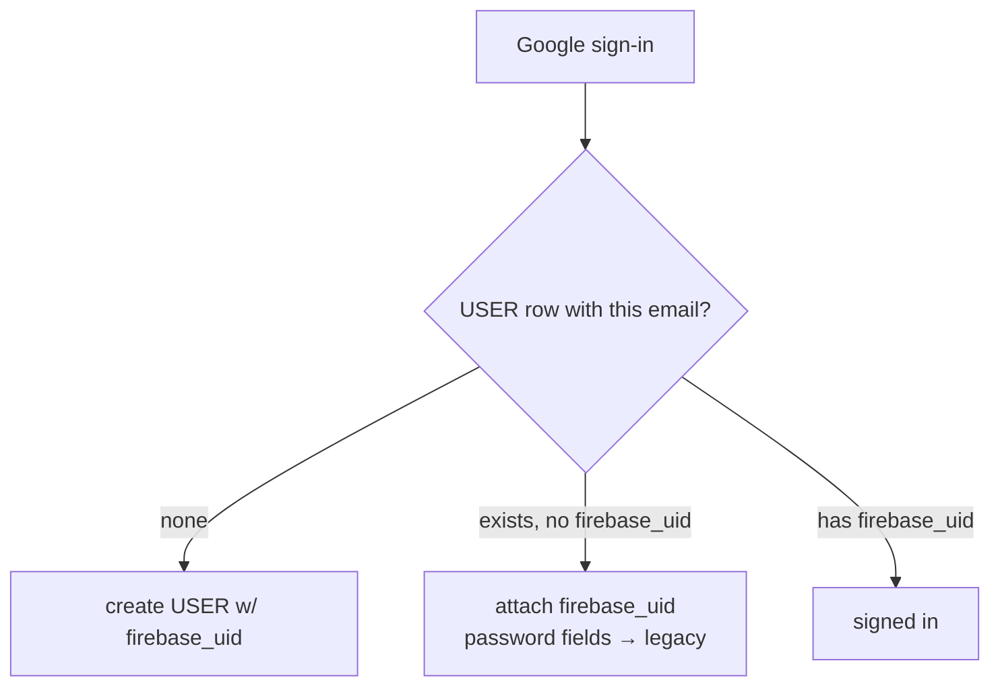

# Flow: Authentication (Google-only, Firebase-backed)

> Implements decision X-1 as hardened 2026-07-16: **Google sign-in only** —
> no username/password, product-wide. Firebase Auth on `sandbox-e306a`.
> Replaces the entire local credential system (signup/signin/forgot/reset/
> change-password in `user_controller.go` + their rate limiters and email
> templates) after the migration window.

## 1. Hard rule & enforcement

Same three layers as the ecosystem standard (apparule flows/auth.md §1):
provider disabled in Firebase console; backend rejects
`sign_in_provider ≠ google.com` (`403 provider_not_allowed`); single
"Continue with Google" CTA. `/signup`, `/forgot-password` routes retire —
`/signin` remains as the one auth screen.

## 2. Session model

Ecosystem standard (inlined): Firebase SDK session — **ID tokens live ~1h,
SDK auto-refreshes**; bearer on every API call; `401 token_expired` → silent
refresh → retry once → sign-out; `401 unauthenticated` for missing/invalid
tokens (both cataloged in engineering.md §1). Upsert `USER` by
`firebase_uid`. Error envelope (ecosystem standard, verbatim):
`{"error": {"code": "snake_case", "message": "human copy", "details": {}}}`. Firebase
throttling replaces the Redis auth rate limiters; Redis limits remain for
non-auth routes.

## 3. Migration of legacy password users

- Google-asserted emails are verified by definition → link-by-email is safe
  (no unverified-email branch needed).
- **Window**: legacy `/users/signin` works 60 days with a "switch to Google"
  banner; then `410 migrate_to_firebase`; password/reset/change-password
  endpoints + email templates deleted; password fields dropped (data-model §3).
- **The stranded-user edge**: a legacy account whose email has no Google
  account (corporate/non-Gmail without Google Workspace). Policy: they sign
  in with *any* Google account and request an email change via support
  (`clients.cuesoft.io`), which re-links history after identity check —
  documented in the migration banner. Expected to be rare; measured by
  `auth_migration_stranded` (support-ticket count).

## 4. Post-auth gates

Consent on first protected action: `tos`, `privacy`, **`ai_processing`**
(declining disables AI-dependent paths only — E-3). Org scoping per E-4
unchanged.

## 5. Instrumentation & acceptance

Events: `auth_signin_completed`, `auth_migration_completed`,
`consent_recorded{document}` (emitted by the consent endpoints, E1-5) —
counters only. `auth_migration_stranded` is **not an ingest event** — it is
a support-ticket tag counted operationally (registry annotation updated).

- [ ] Legacy user links on first Google sign-in; history intact
- [ ] Day-61: legacy endpoints 410; password columns dropped; templates gone
- [ ] Non-Google-provider tokens rejected (crafted-token test)
- [ ] `/signup` + `/forgot-password` routes removed; redirects to `/signin`
- [ ] Rate-limiter middleware removed from auth routes only
