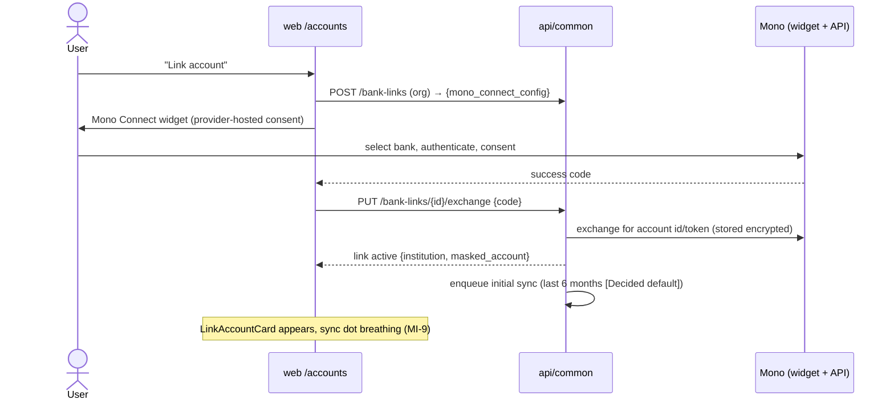

# Flow: Bank Account Linking (Mono)

> Implements E-1 (Mono NG-first). Covers link, sync, re-auth, pause, unlink —
> the full `BANK_LINK` lifecycle (data-model.md §5). Preconditions: authed +
> verified email; org context resolved.

## 1. Linking

Edge cases at link time:

| Case | Behaviour |
| --- | --- |
| Widget closed mid-flow | no link row persisted beyond `pending`; pending rows purged after 1h |
| Same account linked twice (same org) | `409 already_linked` → "This account is already connected" |
| Same account, different org | allowed (personal + company can both see their own view) |
| Bank not supported by Mono | widget handles; our empty-state lists "supported banks" link |
| Exchange fails (code expired) | `422 link_expired` → restart widget |

## 2. Syncing

- Schedule: daily per link + manual "Sync now" (rate-limited 1/10min per link).
- Each sync = one import job (`source: bank_sync`, flows/import.md §5):
  fetch since last cursor → stage → duplicate-detect → categorize → anomaly →
  review (or auto-confirm when enabled).
- Cursor semantics: Mono transaction cursor persisted per link; a failed sync
  never advances the cursor (at-least-once, duplicates handled by staging).

| Sync failure | Behaviour |
| --- | --- |
| `reauth_required` (consent lapsed/bank revoked) | link status flips; persistent banner "Reconnect ×××1234" → widget re-auth flow; syncs paused |
| Mono 5xx / rate-limit | exponential backoff, next scheduled run; after 3 consecutive failures → status `degraded` + banner |
| Partial page fetch | job processes what arrived; cursor advances only past processed transactions |

## 3. Pause / unlink

- **Pause**: stops scheduled syncs; manual sync disabled; card shows paused
  state. Resume re-enables from the stored cursor.
- **Unlink** (`DELETE /bank-links/{id}?purge=`): confirm dialog with the
  keep-or-purge choice (BNK-002):
  - `purge=false` (default): provider token revoked + deleted; imported
    transactions **stay** in the ledger (they're the user's records).
  - `purge=true`: additionally hard-deletes all transactions originating
    from this link (`source_link_id`) + their staged rows — MI-15 danger
    treatment (type-to-confirm), irreversible.
- Provider-side revocation (user revokes at their bank) surfaces as
  `reauth_required` → user chooses reconnect or unlink.

## 4. Security invariants

- Bank credentials never touch our servers (widget is provider-hosted).
- Mono tokens encrypted at rest (KMS/env key via Doppler); never logged;
  never serialized in any API response.
- Webhooks (`/webhooks/bank`) signature-verified; unverified → 401 + alert,
  never processed (same rule as payments in apparule).
- All bank-link mutations audit-logged (who, when, what — no payloads).

## 5. Instrumentation & acceptance

Events: `bank_link_created{institution?}` — institution only if we ratify it
as a permitted dim; default counters only. `bank_sync_completed`,
`bank_reauth_required`.

- [ ] Link → initial 6-month backfill lands in staged review
- [ ] Re-auth banner appears on revocation; reconnect resumes from cursor
- [ ] Unlink keep vs purge both proven (purge removes exactly the link's rows)
- [ ] Failed syncs never advance cursors; no transaction loss under retry
- [ ] Tokens absent from logs, responses, and error messages (grep-proven)
