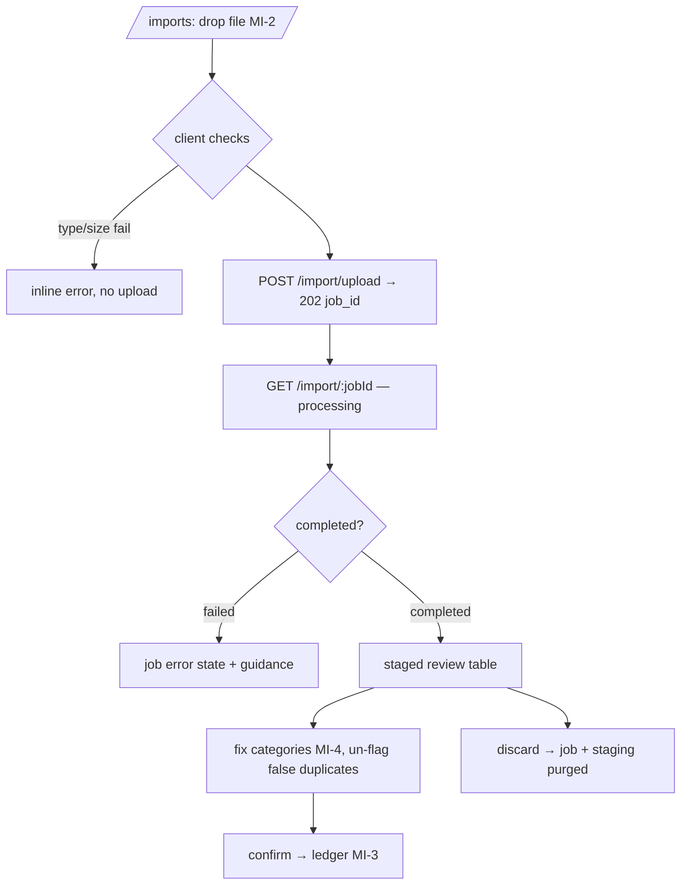

# Flow: Statement / Receipt Import

> The staged-review pipeline (architecture.md §4) from the user's side, with
> every edge case. Target shape is the **async** model (202 + polling,
> roadmap P2); differences from today's synchronous behaviour are marked.
> Preconditions: authed; `ai_processing` consent for PDF-AI/receipt paths
> (flows/auth.md §4).

## 1. Happy path

## 2. Contracts per step

| Step | Contract |
| --- | --- |
| Client checks | CSV/XLSX/TXT/PDF/JPG/PNG/WEBP/HEIC; ≤ 15 MB **[Decided — the binding limit; roadmap exit criteria reference it]**; images client-compressed ≤ 2048px, **server re-validates** (oversize → `413`, oversized-dimension images server-downscaled) |
| Upload | multipart + `Idempotency-Key` (UUID per file selection) — retries never double-import; same key returns the same `job_id` **while the job is processing or completed; a `failed` job releases its key** (retry = same key allowed, new job) |
| Processing | async worker; job status `processing → completed \| failed`; poll every 2s with backoff, or SSE later; UI shows the MI-2 AI-sparkle stage |
| Staged review | duplicates pre-flagged (`is_duplicate`) and excluded from the confirm count by default — user can re-include (false positives happen with recurring identical payments); AI categories carry the ✨ mark until touched |
| Confirm | `POST /import/:jobId/confirm` idempotent (second call → 200 no-op); writes ledger rows atomically — partial confirm is impossible: all-or-error |
| Discard | purges staging + job summary immediately |

## 3. Failure taxonomy

| Code | Cause | UX |
| --- | --- | --- |
| `413 file_too_large` | > limit | inline, no upload |
| `415 unsupported_type` | magic-bytes check fails | "Upload a CSV, PDF, or receipt image" |
| `422 no_transactions_found` | parsed 0 rows (CSV headers unrecognized / PDF text empty / image not a receipt) | job completed-empty state: guidance per file type + "try a CSV export from your bank" |
| `422 password_protected_pdf` | encrypted PDF | "Remove the password and re-upload" |
| `503 ai_unavailable` | AI provider unavailable (Vertex in cloud, X-4; BYO Groq/Gemini self-host) and the file type needs AI (image; PDF after regex fallback fails) | "AI processing is temporarily unavailable" + retry later; CSV path unaffected |
| `403 consent_required` | `ai_processing` consent declined + file type needs AI (images always; PDFs proceed regex-only without AI, with a "reduced accuracy" banner) | consent sheet re-offer |
| `409 job_already_confirmed` | double confirm race | treat as success (idempotent) |
| worker crash mid-job | job auto-marked `failed` by timeout reaper (10 min) | "Something went wrong — nothing was imported" + retry (new job) |

Partial AI extraction (some pages parse, some don't): job completes with
`warnings: ["3 of 12 pages could not be parsed"]` — surfaced as a banner on
the review table, never silent.

## 4. Duplicate semantics

- Detector compares staged rows against **ledger + other staged jobs** on
  (date ±1d, amount exact, normalized description similarity).
- Re-uploading the same statement month → most rows flagged; confirm imports
  only the unflagged remainder — the "overlapping statements" case just works.
- Confirmed duplicates are the user's explicit choice (re-included manually).

## 5. Bank-sync convergence

Bank-synced batches (flows/bank-link.md) enter this same pipeline as jobs
with `source: bank_sync`; per-account **auto-confirm** (opt-in, after ≥3
manually-confirmed clean syncs **[Decided default]**) skips review for
duplicate-free jobs only — any anomaly or duplicate forces review.

## 6. Instrumentation & acceptance

Events: `upload_success{file_type}` (job completed), `import_confirmed`,
`import_discarded` — counters + file_type only (ECO-ANALYTICS constraint).

- [ ] Retry-storm on upload yields exactly one job
- [ ] Confirm is atomic + idempotent under double-click and race
- [ ] Every taxonomy row renders its distinct UX (fixture files per case)
- [ ] Statement re-upload imports only the non-duplicate remainder
- [ ] AI-down leaves CSV imports fully functional
- [ ] No transaction contents in logs (the `[pdf] sample:` class of leak, gone)
