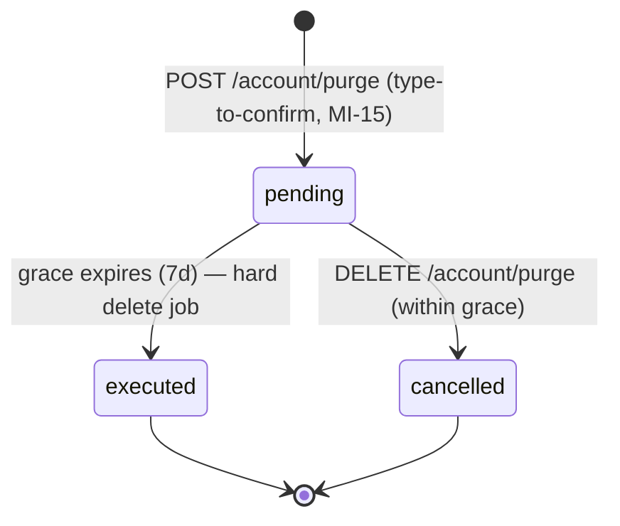

# Flow: Data Rights (export-all, purge)

> USR-001/002 end-to-end with failure paths — the specs behind
> architecture.md §5.3's happy path. Owner-only (engineering §2).

## 1. Export-all (USR-001)

`POST /api/v1/account/export` → `202 {job_id}` → poll
`GET /api/v1/account/export/{job_id}` → `{status: running|completed|failed,
signed_url?, expires_at?}`.

- Archive: ZIP of one CSV per collection (transactions, categories, imports,
  statements, line items, ratio reports, tax estimates/filings metadata) +
  `manifest.json` (org, generated_at, row counts, schema version).
- Signed URL from the X-5 bucket, **7-day TTL**; regeneration = new job.
- Rate: 2/day per org. Failure → `failed` + retry allowed (new job).
- Export during purge grace: allowed — it's the natural "take my data then
  delete" sequence.

## 2. Purge (USR-002)

| Rule | Behaviour |
| --- | --- |
| Grace window | 7 days (E-5); banner shows effective date; email confirmation on request + T-1d reminder |
| During grace | ledger becomes **read-only** (`409 purge_pending` on writes); exports still allowed; sign-in allowed |
| Cancel | owner-only, any time in grace → full restore of write access |
| After execution | `410 grace_expired` on cancel attempts; account row + org(s) where sole owner + all owned data hard-deleted; audit stub retained (org id, executed_at — no content) |
| Duplicate request | `409 purge_pending` (idempotent view of the existing request) |
| Multi-org owners | purge targets the **account**: personal org always; company orgs where sole owner are deleted, others transfer-or-block → `409 org_ownership_transfer_required` listing them |
| Bank links | provider tokens revoked at request time (not execution) — syncing stops immediately |
| Execution failure | job retries daily; grace state persists; ops alert after 3 failures |

## 3. Acceptance

- [ ] Grace-window writes rejected with `purge_pending`; reads + export work
- [ ] Cancel restores writes; post-execution cancel returns `grace_expired`
- [ ] Sole-owner company org blocks purge until transfer (fixture)
- [ ] Provider tokens revoked at request time (verified against Mono sandbox)
- [ ] Export archive opens, manifest row counts match source
