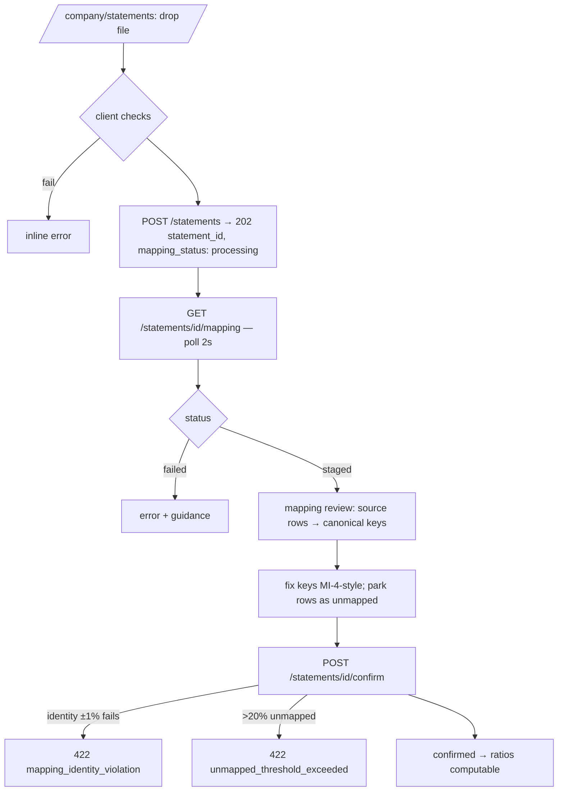

# Flow: Financial-Statement Upload & Mapping

> The company-financials ingress (pages.md B6, line-items.md) with the same
> rigor as flows/import.md. Preconditions: company org context (`X-Org-Id`),
> role admin+ (engineering §2), `ai_processing` consent for AI-suggested
> mapping (declining ⇒ manual mapping only).

## 1. Flow

## 2. Contracts per step

| Step | Contract |
| --- | --- |
| Client checks | CSV/XLSX/PDF, ≤ 15 MB (shared limit); statement `kind` + `period` selected at upload |
| Upload | `Idempotency-Key` per file selection; same-key semantics as flows/import.md §2 (failed releases the key) |
| Parse + suggest | tabular → direct row extraction; PDF → text extraction → AI mapping suggestions (Vertex, X-4); every suggestion carries `confidence` 0–1; rows with confidence < 0.6 arrive **unmapped** rather than guessed **[Decided]** |
| Mapping review | per-row canonical-key combobox (closed vocabulary, line-items.md §1–3); currency field user-confirmed (mismatch vs org ⇒ `422 currency_mismatch`, line-items §4) |
| Confirm | runs derivations + identity cross-check (line-items §4); immutable once confirmed — corrections = upload a replacement statement for the same period (supersedes, keeps audit history) |

## 3. Failure taxonomy

| Code | Cause |
| --- | --- |
| `413 file_too_large` / `415 unsupported_type` | limits |
| `422 no_line_items_found` | parse produced zero rows |
| `422 password_protected_pdf` | encrypted |
| `503 ai_unavailable` | Vertex down — manual mapping still available (suggestions absent) |
| `422 mapping_identity_violation` · `422 unmapped_threshold_exceeded` · `422 currency_mismatch` | confirm-time rules (line-items §4) |
| `409 period_exists` | confirmed statement of same kind+period exists — offer supersede |

## 4. Mapping state machine

`processing → staged → confirmed`, plus `processing → failed` and
`staged → superseded` (replacement confirmed). `RATIO_REPORT`s reference only
`confirmed` statements; superseding recomputes affected reports (old reports
keep their trace to the superseded statement — auditability over tidiness).

## 5. Limits & instrumentation

Rate limit: 10 statement uploads/hr per org (engineering §3 table gains this
row). Events: `statement_confirmed{kind}` — **register in the master registry
before implementation**.

## 6. Acceptance

- [ ] Fixtures per taxonomy row (incl. an identity-violating balance sheet)
- [ ] Low-confidence suggestions arrive unmapped, never silently guessed
- [ ] Supersede path recomputes ratios and preserves old traces
- [ ] Consent-declined path offers manual mapping with no AI call made
