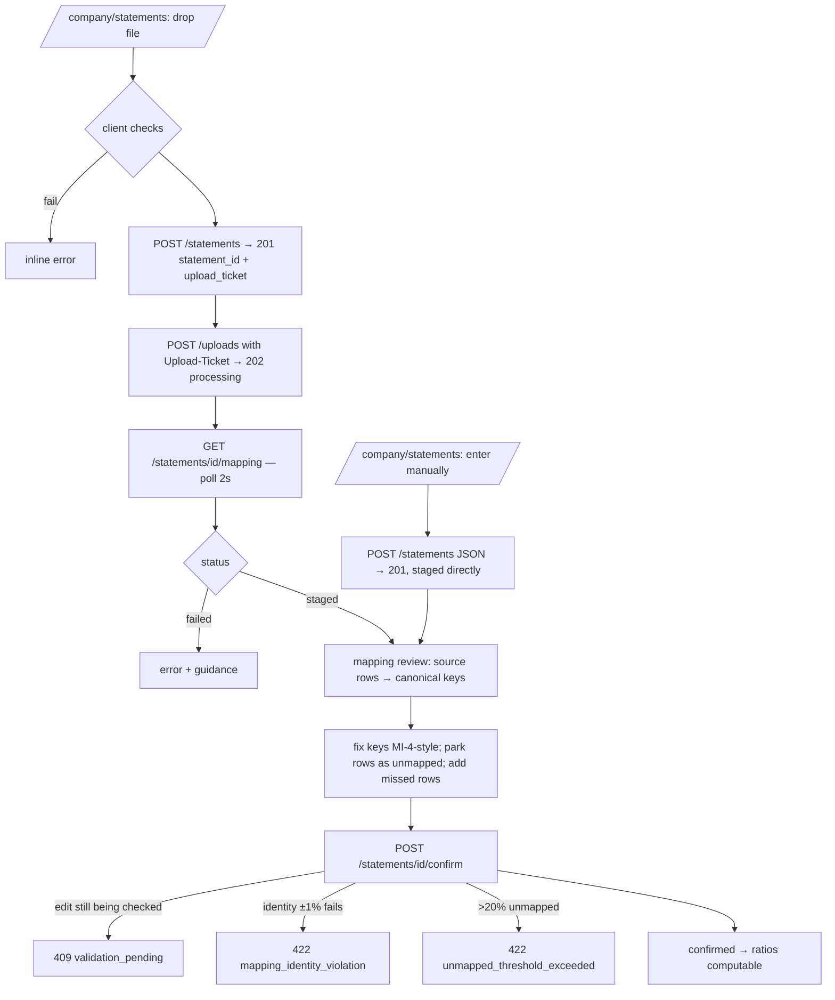

# Flow: Financial-Statement Upload & Mapping

> The company-financials ingress (pages.md B6, line-items.md) with the same
> rigor as flows/import.md. Preconditions: company org context (`X-Org-Id`),
> role admin+ (engineering §2), `ai_processing` consent for AI-suggested
> mapping (declining ⇒ manual mapping only).

## 1. Flow

```mermaid
flowchart TD
    UP[/company/statements: drop file/] --> VAL{client checks}
    MAN[/company/statements: enter manually/] --> MPOST[POST /statements JSON → 201, staged directly]
    VAL -->|fail| E0[inline error]
    VAL --> POST[POST /statements → 201 statement_id + upload_ticket]
    POST --> SEND[POST /uploads with Upload-Ticket → 202 processing]
    SEND --> POLL[GET /statements/id/mapping — poll 2s]
    POLL --> ST{status}
    ST -->|failed| FAIL[error + guidance]
    ST -->|staged| REVIEW[mapping review: source rows → canonical keys]
    MPOST --> REVIEW
    REVIEW --> FIX[fix keys MI-4-style; park rows as unmapped; add missed rows]
    FIX --> CONFIRM[POST /statements/id/confirm]
    CONFIRM -->|edit still being checked| E3[409 validation_pending]
    CONFIRM -->|identity ±1% fails| E1[422 mapping_identity_violation]
    CONFIRM -->|>20% unmapped| E2[422 unmapped_threshold_exceeded]
    CONFIRM --> DONE[confirmed → ratios computable]
```

## 2. Contracts per step

| Step | Contract |
| --- | --- |
| Client checks | CSV/XLSX/PDF **plus scanned/photographed statements: JPG/PNG/HEIC and image-only PDFs [Decided 2026-07-16]**, ≤ 15 MB (shared limit); statement `kind` + `period` (closed-grammar picker, line-items.md §6) selected at upload |
| Upload | Create-then-upload, as flows/import.md §2 **[Built 2026-10-05]**: `POST /statements {kind, period, file_name, size}` → `201 {statement_id, upload_ticket}`, then `POST /uploads` with the ticket → `202`. `Idempotency-Key` per file selection, with the same-key semantics (failed releases the key). Statement uploads are limited to 10/hr per org. |
| Manual entry | `POST /statements` with JSON `{kind, period, currency, line_items: [{canonical_key, amount, label?}]}` → `source_file_type: manual`, lands **directly in `staged`** (no parse, no AI call, no `ai_processing` consent needed) — same review + confirm-time validations as uploads |
| Parse + suggest | **[Built 2026-10-05 for CSV/XLSX; PDF and image statements return `ai_unavailable` until AI table extraction lands]** tabular → direct row extraction; PDF → text extraction → AI mapping suggestions (Vertex, X-4); **images + image-only PDFs (no text layer) → AI vision extraction — the flows/import.md VIS path reused; requires `ai_processing` consent [Decided 2026-07-16]**; every suggestion carries `confidence` 0–1; rows with confidence < 0.6 arrive **unmapped** rather than guessed **[Decided]** |
| Mapping review | per-row canonical-key combobox (closed vocabulary, line-items.md §1–3); **rows the parser missed can be added** (canonical_key + amount — added rows count toward the identity check); currency field user-confirmed (mismatch vs org ⇒ `422 currency_mismatch`, line-items §4) |
| Mapping edits | `PATCH /statements/{id}/mapping` saves the edit, bumps `mapping_version` and asks api/analytics' compute pool to re-run the derivations and checks (S-7). The result is stored against that version. |
| Confirm | a CRUD check of the stored validation (S-8): `409 validation_pending` while the latest edit is still being checked, else the stored code (`422 mapping_identity_violation`, `422 unmapped_threshold_exceeded`), else confirmed. Immutable once confirmed: corrections mean uploading a replacement statement for the same period (it supersedes the old one and keeps the audit history). Confirm queues the period's ratios. |

## 3. Failure taxonomy

| Code | Cause |
| --- | --- |
| `413 file_too_large` / `415 unsupported_type` | limits |
| `422 no_line_items_found` | parse produced zero rows |
| `422 password_protected_pdf` | encrypted |
| `403 consent_required` | scanned/image statement with `ai_processing` consent declined — guidance: export CSV/XLSX from the accounting tool, or use manual entry |
| `503 ai_unavailable` | Vertex down — manual mapping still available for text uploads (suggestions absent); scanned/image statements cannot parse → guidance: export CSV/XLSX or use manual entry |
| `422 mapping_identity_violation` · `422 unmapped_threshold_exceeded` · `422 currency_mismatch` | confirm-time rules (line-items §4) |
| `409 period_exists` | confirmed statement of same kind+period exists — offer supersede |

## 4. Mapping state machine

`processing → staged → confirmed`, plus `processing → failed` and
`staged → superseded` (replacement confirmed). `RATIO_REPORT`s reference only
`confirmed` statements; superseding recomputes affected reports (old reports
keep their trace to the superseded statement — auditability over tidiness).

## 5. Limits & instrumentation

Rate limit: 10 statement uploads/hr per org (engineering §3 table gains this
row). Events: `statement_confirmed{kind}` — **register in the master registry
before implementation**.

## 6. Acceptance

- [ ] Fixtures per taxonomy row (incl. an identity-violating balance sheet
      and a scanned/photographed balance sheet through the vision path)
- [ ] Low-confidence suggestions arrive unmapped, never silently guessed
- [ ] Supersede path recomputes ratios and preserves old traces
- [ ] Consent-declined path offers manual mapping with no AI call made;
      consent-declined scanned/image statements get the CSV/XLSX +
      manual-entry guidance
- [ ] Manual-entry statement skips parse/AI entirely and passes the same
      confirm-time validations
- [ ] Rows added in review (parser-missed) flow into derivations and the
      identity check
