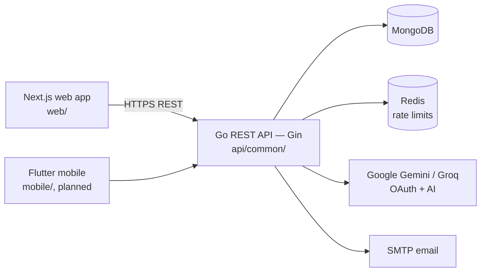

# Overview

Expendit is an open-source expense-tracking application — record expenses,
categorize them, import statements, and generate real-time reports. This
document describes the high-level architecture and each component's
responsibilities. To run the stack locally, see [setup.md](setup.md).

## Architecture

- **`web`** — Next.js marketing site + authenticated dashboard (React,
  TypeScript). Talks to the API over HTTP (REST).
- **`mobile`** — Flutter app + native shells (`mobile/{flutter,android,ios}`),
  placeholders today, consuming the same API.
- **`api/common`** — Go service (module `github.com/cuesoftinc/expendit/api/common`, Gin): the source of
  truth for auth/users, expenses/income/categories, statement imports (CSV/PDF
  parsing, dedup, categorization), AI-assisted summaries (Gemini/Groq), and
  reporting.
- **Auth** — JWT (`golang-jwt`) plus Google OAuth.
- **Data** — MongoDB (records); Redis for rate limiting (in-memory fallback).

Backend services are named by **function**, never by language: the current
service is `api/common`; a future one would be `api/<function>`. See the
[repository structure](../README.md#repository-structure) in the README.

## Product & design documentation
> Published site: **https://cuesoft.gitbook.io/expendit** (Git-synced from this folder on every merge to main).

- [prd.md](prd.md) — product requirements breakdown (requirements vs current state, user rights, open questions)
- [architecture.md](architecture.md) — system design, import-pipeline deep dive, target sequences
- [data-model.md](data-model.md) — current + target entities, identity migration, data classification
- [api.md](api.md) — full current surface and v1 deltas with gap analysis
- [roadmap.md](roadmap.md) — phased plan with dependencies
- [design.md](design.md) + [pages.md](pages.md) — design language, screens, microinteractions
- [line-items.md](line-items.md) — canonical statement vocabulary + ratio formula registry
- [decisions.md](decisions.md) — the open-decision register: ratify to unblock phases
- [deployment.md](deployment.md) — Cloud Run + App Hosting contract (cuesoft-iac provisioning, CI/CD pattern)
- flows/ — feature flow specs with edge cases: [auth](flows/auth.md), [import](flows/import.md), [bank-link](flows/bank-link.md)
- [tax-engine.md](tax-engine.md) — NG PIT/CIT/VAT computation contract (versioned rule sets, trace requirements)
- [engineering.md](engineering.md) — error catalog, authz matrix, rate limits, testing strategy, logging rules
- [features.md](features.md) — granular build backlog (stable unit IDs per phase)
