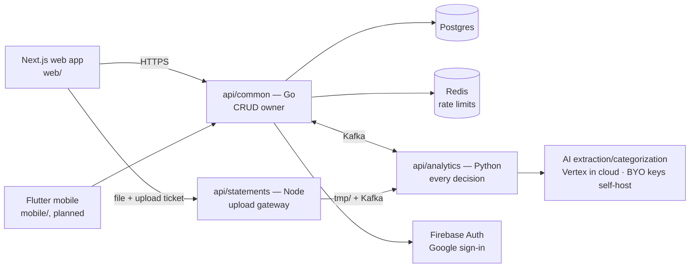

# Overview

Expendit is an open-source expense-tracking application — record expenses,
categorize them, import statements, and generate real-time reports. This
document describes the high-level architecture and each component's
responsibilities. To run the stack locally, see [setup.md](setup.md).

## Architecture

```mermaid
flowchart LR
    WEB[Next.js web app<br/>web/] -->|HTTPS| COM[api/common — Go<br/>CRUD owner]
    WEB -->|file + upload ticket| ST[api/statements — Node<br/>upload gateway]
    MOB[Flutter mobile<br/>mobile/, planned] --> COM
    COM --> PG[(Postgres)]
    COM --> RD[(Redis<br/>rate limits)]
    COM <-->|Kafka| AN[api/analytics — Python<br/>every decision]
    ST -->|tmp/ + Kafka| AN
    AN --> AI[AI extraction/categorization<br/>Vertex in cloud · BYO keys self-host]
    COM --> FB[Firebase Auth<br/>Google sign-in]
```

- **`web`**: Next.js marketing site and authenticated dashboard (React,
  TypeScript). Talks to `api/common` over HTTP, and sends upload files to
  `api/statements` with a ticket.
- **`mobile`**: Flutter app and native shells (`mobile/{flutter,android,ios}`),
  placeholders today, consuming the same API.
- **`api/common`** (Go): the CRUD owner and the only service that touches
  Postgres. It handles auth (Firebase), orgs and roles, the ledger, imports,
  statements, stored ratios and tax figures, upload tickets, and the outbox.
- **`api/statements`** (Node, NestJS): the thin upload gateway. It checks the
  ticket and the file, stores the file temporarily, and hands a pointer to
  Kafka.
- **`api/analytics`** (Python): every decision. Parsing, duplicates,
  categories, anomalies, summaries, statement mapping, ratios and tax.
- **Data**: Postgres (records), object storage for uploads until parsed,
  Kafka between services, Redis for rate limits.

The full design is [system-design.md](system-design.md); the as-built view
is [architecture.md](architecture.md).

Backend services are named by **function**, never by language:
`api/common`, `api/statements`, `api/analytics`. See the
[repository structure](https://github.com/cuesoftinc/expendit#repository-structure) in the README.

## Product & design documentation
> Published site: **https://cuesoft.gitbook.io/expendit** (Git-synced from this folder on every merge to main).

- [prd.md](prd.md) — product requirements breakdown (requirements vs current state, user rights, open questions)
- [architecture.md](architecture.md) — system design, import-pipeline deep dive, target sequences
- [data-model.md](data-model.md) — current + target entities, identity migration, data classification
- [api.md](api.md) — full current surface and v1 deltas with gap analysis
- [roadmap.md](roadmap.md) — phased plan with dependencies
- [design.md](design.md) + [pages.md](pages.md) — design language, screens, microinteractions
- [line-items.md](line-items.md) — canonical statement vocabulary + ratio formula registry
- [decisions.md](decisions.md) — the ratified decision register (governs all docs)
- [deployment.md](deployment.md) — Cloud Run + App Hosting contract (cuesoft-iac provisioning, CI/CD pattern)
- flows/ — feature flow specs with edge cases: [auth](flows/auth.md), [import](flows/import.md), [bank-link](flows/bank-link.md)
- [tax-engine.md](tax-engine.md) — NG PIT/CIT/VAT computation contract (versioned rule sets, trace requirements)
- [engineering.md](engineering.md) — error catalog, authz matrix, rate limits, testing strategy, logging rules
- [features.md](features.md) — granular build backlog (stable unit IDs per phase)
