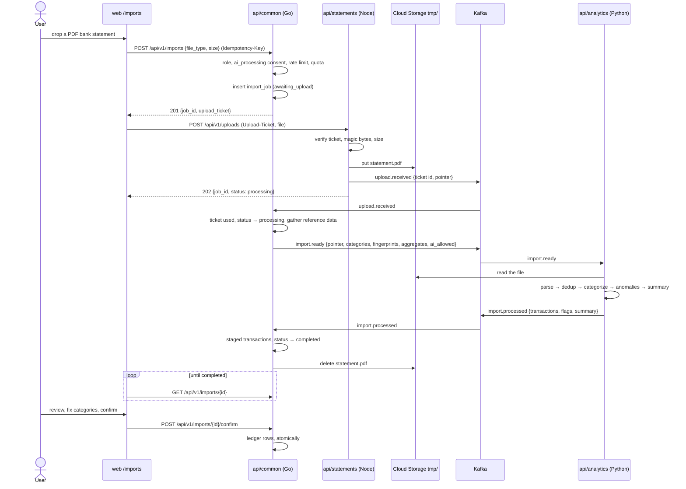
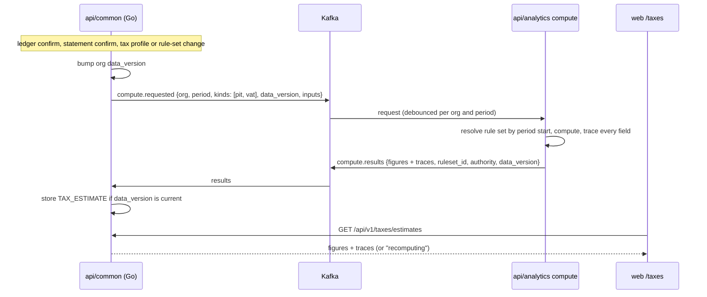

# Expendit — System Design

> **Status: [Decided] v1 — ratified 2026-10-05** (S-1…S-14 in
> [decisions.md](decisions.md#system-design-s-1--s-14); S-2 signed off by
> the product lead). Built the same day; §16 records what changed during
> implementation. This document replaces the system design described across
> `architecture.md` §1–§4, §6 and §8, `data-model.md` §4 (raw-file handling
> only), and `deployment.md` §1 and §4, which were rewritten from it. It keeps every **product**
> decision in [decisions.md](decisions.md) (E-1…E-6 apart from one line of
> E-5, and X-1…X-10) and every **behavioural** contract in the flow docs
> (import, bank link, statement mapping, rights, auth), the tax engine and
> the line-item registry. What it replaces is the **shape of the system**:
> service boundaries, transports, data ownership, and where each piece of
> work runs. New decisions it needs are listed in §13 as **S-1…S-14**. It
> supersedes the earlier "Expendit Pipeline" draft, which covered the
> import pipeline only.
>
> **Language rule (CueLABS standard, applied the same way as Upstat's and
> Apparule's system designs):**
> - **Go does CRUD only.** `api/common` owns and persists all data.
> - **Python does all processing:** every decision, such as parsing,
>   categories, duplicates, anomalies, statement mapping, ratios, tax
>   figures and AI narratives.
> - **The gateway is thin.** It validates and hands off (Node, NestJS).
> - **No serverless functions.** The standard reserves them for probes,
>   and Expendit has none.
>
> Services are named by function (`statements`, was `intake`; `analytics`,
> was `process`) and connected through Aiven Kafka.

## Contents

1. Why redesign — audit of the current design
2. Design drivers
3. Architecture overview
4. Services
5. Data architecture
6. Key flows
7. API surface
8. Security and tenancy
9. Reliability, failure modes, and capacity
10. Deployment topology
11. Repository layout
12. Doc map — keep, change, retire
13. Decisions to ratify
14. Migration plan
15. Open questions
16. Implementation notes

---

## 1. Why redesign — audit of the current design **[Current docs]**

This audit is of the **documented design** (architecture.md, data-model.md,
deployment.md, the flow docs, the tax engine) and the "Expendit Pipeline"
draft. Expendit is further along than Apparule: the three-service import
pipeline already exists and already talks over Kafka. What doesn't follow
the method yet is where data lives, who is allowed to touch it, and where
the newer pillars (bank linking, company statements, tax) do their work.

| # | Finding | Evidence | Consequence |
| --- | --- | --- | --- |
| F1 | **The pipeline draft gives every service a database.** `statements` writes a Postgres staging table; `analytics` reads the ledger tables and the staging table directly. | Expendit Pipeline draft, DB access matrix | Breaks the standard twice: the gateway "owns no persisted state", and the processing service "never opens its own connection to Go's datastore". Three writers/readers on one schema, and the ledger's owner no longer sees every access. |
| F2 | **Kafka carries the whole file, base64-encoded.** | architecture.md §4.1 ("base64 the file") | Kafka's default message cap is 1 MB; base64 adds a third; the upload limit is 15 MB. Real statements fail. |
| F3 | **The fix for F2 contradicts E-5.** The draft's claim-check puts the raw file in Cloud Storage, but E-5 says raw uploads are "never at rest". | decisions.md E-5; data-model.md §4 | Either the privacy promise or the pipeline has to change, and the draft doesn't say which. |
| F4 | **Nothing is authorized before the bytes arrive.** The gateway only checks a token; `ai_processing` consent (E-3), org role (statements need admin+), rate limits (10 uploads/hr per org) and the upload cap all live in `common`, which sees the upload after the fact. | architecture.md §3.2; engineering.md §2–§3; flows/statement-mapping.md | A receipt image can be accepted and queued for AI without the consent E-3 requires. |
| F5 | **The gateway's idempotency is per instance, and its auth is a shared secret.** In-memory `Idempotency-Key` cache; HS256 `JWT_SECRET` shared with `common`, while X-1 says Firebase. | architecture.md §3.2, §4.2 | Retries on a second replica double-import; a leaked gateway secret can mint user sessions. |
| F6 | **Go makes decisions.** The AI dashboard summary is "kept in Go on purpose"; statement derivations and the ±1 % identity check run inside `common`'s confirm endpoint; the tax engine and ratio engine have no assigned service, so they default to `common`. | architecture.md §3.1; flows/statement-mapping.md §2; tax-engine.md; line-items.md §4–§5 | Breaks the standard; the tax and ratio code (the product's most audited logic) would land in the CRUD service. |
| F7 | **Kafka consumers on scale-to-zero services.** "min-instances 0 everywhere". | architecture.md §8; deployment.md §4 | `common` and `analytics` stop consuming once idle; imports hang in `processing` until the 10-minute reaper fails them. |
| F8 | **The docs disagree.** 10 MB in the gateway vs 15 MB decided; §1 still draws MongoDB, §8 Postgres; JWT in §3.2 vs Firebase in X-1; the gateway has no assigned domain. | architecture.md §1, §3.2, §4.2, §8; deployment.md §4 | Contributors can't tell which design is current. |
| F9 | **Expendit's place as an Upstat customer isn't drawn.** Events (Upload Success, Report Generation) and OTLP appear only as notes. | architecture.md §2, §7 | The dependency on Upstat's ingest (D2) is invisible in the system picture. |

What *is* solid and carries forward: every product decision; the import
pipeline's decision logic (parse → dedup → categorize → anomalies →
summary) and its Kafka shape; the flow contracts (import, bank link,
statement mapping, rights); the tax engine's rules-as-data and trace model;
the line-item and ratio registry; X-5's single Postgres; the web mock API;
the CI/CD and tag-gated deploy model (X-6).

---

## 2. Design drivers

| # | Driver | Design response |
| --- | --- | --- |
| D1 | **Financial data is the most sensitive thing we hold.** | Nothing is accepted until `common` has authorized it (upload tickets, §6.1). Raw files sit in Cloud Storage only until parsed, then `common` deletes them. Kafka carries pointers, not files. Nothing sensitive is logged (data-model.md §4). |
| D2 | **Language by role** (the standard's pipeline rule). | Go = CRUD (`common`). Python = processing (`analytics`). Node = thin gateway (`statements`). |
| D3 | **One owner per store.** | Postgres is read and written only by `api/common`. The gateway and `analytics` have no database connection at all. |
| D4 | **Asynchronous between services, with no exceptions.** | Kafka carries every handoff. `analytics` gets the reference data it needs inside the message (categories, fingerprints for the relevant date window, historical aggregates, rule sets). No gRPC. |
| D5 | **Every number can be traced.** | Tax and ratio figures are computed in `analytics` with `{value, ruleset_id, inputs, formula}` and stored by `common` exactly as computed (tax-engine.md §5). Recomputation is event-driven, so a stored figure is always tied to the data version it came from. |
| D6 | **Config flows outward as events.** | Tax rule sets and their sign-offs publish through a transactional outbox to a compacted topic. |
| D7 | **Users see progress, not a hanging request.** | Every asynchronous step has a status row in `common` that the client polls (the boss's "keep refreshing"). |
| D8 | **Slow AI must not delay a tax figure.** | `analytics` runs as two worker pools from one image: `extract` (parsing, AI) and `compute` (ratios, tax, validation). |
| D9 | **One set of images for cloud and self-host.** | Postgres, Kafka KRaft, Redis and MinIO in compose; Groq/Gemini BYO keys for self-host AI (X-4). |

---

## 3. Architecture overview

```mermaid
flowchart LR
    subgraph Clients
        BR[Browser]
        MOB[Mobile app<br/>receipt capture]
        MONO[Mono]
    end

    subgraph Edge
        WEB[web — Next.js<br/>App Hosting + CDN]
        LB{{HTTPS load balancer<br/>api.expendit.cuesoft.io}}
    end

    COMMON[api/common — Go<br/>CRUD · auth · ledger · orgs · tax/ratio storage<br/>tickets · outbox · bank sync · sweeps]
    ST[api/statements — Node<br/>thin gateway]

    subgraph Python — processing
        AN[api/analytics — Python<br/>extract pool: parse · dedup · categorize · anomalies · AI<br/>compute pool: mapping checks · ratios · tax · summaries]
    end

    PG[(Aiven Postgres)]
    GCS[(Cloud Storage)]
    R[(Aiven Redis)]
    K[[Aiven Kafka]]
    VX[Vertex AI]
    UPS[Upstat<br/>OTLP + events]

    BR --> WEB
    BR --> LB
    MOB --> LB
    WEB -->|SSR| LB
    MONO -->|webhooks| LB
    LB -->|/api/v1/* default| COMMON
    LB -->|/api/v1/uploads + ticket| ST

    ST -->|put tmp/| GCS
    ST -->|pointers| K
    COMMON --> PG
    COMMON -->|delete after parse · reports| GCS
    COMMON -->|token exchange, daily sync| MONO
    COMMON -->|ready · compute requests · rule sets| K
    K -->|processed · results| COMMON
    K --> AN --> K
    AN -.->|read tmp/| GCS
    AN --> VX
    COMMON -.- R
    COMMON & ST & AN -.->|OTLP · events| UPS
```

---

## 4. Services

Three deployables we write (web, one Go, one Node, one Python with two
worker pools). Ports are unchanged: `api/common` 8080, `statements` 8081,
`analytics` 8082.

| Unit | Lang | Role | Responsibility | Owns | Port |
| --- | --- | --- | --- | --- | --- |
| `web` | Next.js | Frontend | Landing (with the demo-data preview), dashboard: transactions, imports, accounts, reports, company statements and ratios, taxes and filing wizard, categories, settings and data rights | — | 3000 |
| `api/common` | **Go** | **CRUD** | Firebase auth, orgs and roles, ledger (expenses, incomes, categories), import jobs and staged transactions, confirm/discard, bank links (Mono widget exchange, encrypted tokens, **daily sync fetch** — lookup, fetch, relay), company statements and line items, tax profiles, stored ratio reports, tax estimates and filings, report rendering (CSV/PDF), data rights (export-all, purge), consent. **Authorizes every upload** and issues its signed ticket. **Outbox publisher.** Scheduled sweeps. Persists every decision Python makes. | **Postgres** (sole client), Cloud Storage | 8080 |
| `api/statements` | **Node** (NestJS) | Thin gateway | Receipts, bank-statement files and company statements: verifies the upload ticket `common` issued (public key, no call), magic-bytes type check, size and image-dimension checks against the ticket, server-side downscaling of oversized images, write to temporary Cloud Storage, pointer → Kafka. Stateless. | nothing: no database, no Redis | 8081 |
| `api/analytics` | **Python** | Processing | **Extract pool:** file-type detection, CSV/XLSX/PDF parsing, AI extraction and vision (Vertex; BYO Groq/Gemini for self-host), duplicate detection, categorization, the 4 anomaly rules, import summary and narrative, statement mapping suggestions with confidence. **Compute pool:** statement derivations, identity and unmapped-threshold checks, ratios with benchmark bands, PIT/CIT/VAT against signed rule sets, authority resolution, the dashboard AI summary. | nothing; reference data arrives in messages | 8082 |

**Retired:** the base64 file in Kafka; the gateway's in-memory idempotency
cache and its `JWT_SECRET`; the pipeline draft's staging table and
`analytics`' read access to Postgres; the Go AI-summary service; the
derivation and identity checks inside `common`'s confirm handler.

**Why these boundaries.**
- **`statements` is separate from `common`** so 15 MB uploads never queue
  in front of the ledger API, and so upload capacity scales on its own.
- **One Python service with two pools, not two services.** Unlike Upstat
  (where an ML crash must never delay a "site is down" alert), nothing in
  Expendit is urgent enough to need its own codebase. Two pools from one
  image give the same fate isolation: a slow Vertex call in `extract`
  never delays a tax recomputation in `compute`. If the compute side grows
  its own team or release cadence, it splits into `api/tax` later (§15).
- **Bank sync stays in `common`.** Fetching from Mono is lookup-then-relay
  with a stored, encrypted credential (like Upstat's scheduler calling its
  probes). Every decision about the fetched transactions still happens in
  `analytics`, through the same import pipeline.
- **Report rendering stays in `common`.** Turning stored figures into CSV
  or PDF is formatting, not a decision.

---

## 5. Data architecture

### 5.1 Stores and ownership

| Store | Holds | Written by | Read by | Source of truth? |
| --- | --- | --- | --- | --- |
| **Aiven Postgres** (X-5) | Every domain entity (data-model.md §1, §2, §5), staged import transactions, tax and ratio traces, raw Mono webhook events, outbox | `api/common` | `api/common` | Yes |
| **Cloud Storage** `expendit/<env>/tmp/…` | Uploaded files until parsed | `statements` | `analytics` (read), `common` (delete) | No; deleted as soon as `analytics` reports back |
| **Cloud Storage** `expendit/<env>/{reports,exports,compute}/…` | Report artifacts (30 days, E-5), export-all archives, large compute inputs (§5.3) | `common` | `common` (signed URLs), `analytics` (compute inputs) | Yes, for artifacts |
| **Aiven Kafka** | Handoffs + compacted config (§5.3) | per topic | per topic | No; a durable buffer. Config topics rebuild from Postgres. |
| **Aiven Redis** (`REDIS_DB` index) | Rate limits (engineering.md §3) and the daily upload quota, counted when tickets are issued | `common` | `common` | No. Losing it is survivable (§9.2). |

`statements` and `analytics` use no Redis and no database. The gateway is
stateless; `analytics` keeps only in-memory state rebuilt from Kafka on
start (the rule-set map).

### 5.2 Postgres

The Mongo→Postgres move is already decided (X-5, run with the E-4 org
migration, data-model.md §6.3). This design adds:

| Addition | Why |
| --- | --- |
| `upload_ticket` (`jti`, owner org, target `import_job` or `fin_statement`, `max_bytes`, `expires_at`, `used_at`) | Single-use tickets (§6.1) |
| `import_job.idempotency_key` and `fin_statement.idempotency_key` (unique per org, released on `failed`) | Replaces the gateway's in-memory cache; the flows/import.md §2 semantics hold across replicas |
| `import_job.status` gains `awaiting_upload` | The job exists before the bytes do |
| `fin_statement.validation` (`{ok, codes[], mapping_version}`) | Written from `analytics`' results; confirm is a CRUD check against it (§6.4) |
| `*.data_version` on org ledger and statements | Tax and ratio results carry the version they were computed from; stale results are marked "recomputing" |
| `provider_event` (Mono webhooks, raw, unique by provider id) | Stored before anything acts on them |
| `outbox` | Transactional outbox (§6.6) |

Tenancy is enforced with row-level security keyed on `org_id` (S-11).

### 5.3 Kafka topics

Expendit shares the Aiven Kafka service with Upstat and Apparule, so every
topic carries the product prefix. All topics use keys. Messages are JSON
validated against JSON Schemas in `api/common/contract/` (replacing the
hand-kept Pydantic/TS/Go trio). A payload over 512 KB (a large bank
backfill, a full-year tax input) goes to `compute/` in Cloud Storage and
the message carries the pointer.

| Topic | Key | Retention | Producer → consumers |
| --- | --- | --- | --- |
| `expendit.config.rulesets` | ruleset id | **compacted** | common (outbox) → analytics |
| `expendit.upload.received` | ticket id | 24 h | statements → common |
| `expendit.import.ready` | job id | 24 h | common (outbox) → analytics (extract) |
| `expendit.import.processed` | job id | 24 h | analytics → common |
| `expendit.statement.ready` | statement id | 24 h | common (outbox) → analytics (extract) |
| `expendit.statement.mapped` | statement id | 24 h | analytics → common |
| `expendit.compute.requested` | org id | 24 h | common (outbox) → analytics (compute) |
| `expendit.compute.results` | org id | 24 h | analytics → common |

Every topic carries financial data except `config.rulesets`, so
retention stays at 24 h and each topic is readable only by its consumer's
Kafka user (§8).

---

## 6. Key flows

### 6.1 One statement import



- **`common` authorizes before anything is stored.** Role (engineering.md
  §2), `ai_processing` consent for file types that need AI (E-3:
  images always; PDFs fall back to regex without it), the 10/hr and
  30/day upload limits and the daily byte quota are all checked when the
  job is created. The file type is declared up front, so a receipt image
  from a user without AI consent gets `403 consent_required` before it
  leaves the browser.
- **The upload ticket.** Short-lived (5 minutes), single use, signed by
  `common` (Ed25519). Claims: org, job or statement id, declared type,
  `max_bytes` (15 MB, the flows/import.md figure; the ticket makes it the
  single source of truth, ending the 10 vs 15 MB disagreement). The
  gateway verifies it with `common`'s public key and never holds a key
  that can mint tickets.
- **Raw file lifetime.** The file exists only between upload and
  `import.processed`, normally seconds. `common` deletes it when it
  records the result (or the failure). A sweep deletes anything in
  `tmp/` older than 1 hour, and a 1-day bucket lifecycle rule is the last
  backstop (Cloud Storage lifecycle can't act in hours). This revises
  E-5's "never at rest" (S-4).
- **Reference data is scoped.** Duplicate fingerprints cover only the
  statement's date window ±1 day (flows/import.md §4), not the whole
  ledger, so `import.ready` stays small.
- **Failures.** The typed codes in flows/import.md §3 come back on the
  job. `413` and `415` are answered by the gateway at once. The 10-minute
  reaper stays as a `common` sweep.

### 6.2 Bank sync

The daily sweep (02:00–05:00 org-local, jittered) and "Sync now" run in
`common`: it decrypts the link's token, fetches from Mono since the
stored cursor, and creates an import job with `source: bank_sync`. The
fetched transactions go into `import.ready` (inline, or via `compute/`
when large) and run through the exact pipeline in §6.1 from the
`analytics` step on. The cursor advances only when `common` records
`import.processed` (at-least-once; duplicates are caught by the detector).
Auto-confirm (flows/import.md §5) is a lookup-then-write in `common`
against flags `analytics` set.

### 6.3 Company statement upload and mapping

Same ticket and upload path as §6.1, into `statement.ready`. `analytics`
parses, suggests a canonical key per row with a confidence (below 0.6
arrives unmapped), runs derivations and the identity and
unmapped-threshold checks, and returns everything on `statement.mapped`.
Manual entry skips the upload and AI but still goes through `compute`
for validation.

### 6.4 Mapping edits and confirm

Every user edit in the mapping review is saved by `common`, bumps the
statement's `mapping_version`, and publishes a `compute.requested
{kind: statement_validation}`. `analytics` recomputes derivations, the
±1 % identity and the >20 % unmapped threshold and returns
`{ok, codes, mapping_version}`. **Confirm stays synchronous:** `common`
checks that the stored validation matches the current `mapping_version`
and is `ok`, then confirms; otherwise it returns the stored code
(`422 mapping_identity_violation`, `422 unmapped_threshold_exceeded`) or
`409 validation_pending` while a recomputation is in flight. The check
itself is CRUD; the arithmetic happened in Python.

### 6.5 Tax estimates and ratios



Ratios follow the same path on statement confirm (`kinds: [ratios]`),
stored as `RATIO_REPORT`. **Filing drafts** (TAX-002) request `kind:
filing` with the full-period inputs; `common` checks the preconditions it
owns first (period complete, rule set signed off, tax identity complete)
and renders the filing pack PDFs from the returned figures.

### 6.6 Config propagation (outbox)

A `common` write and its outbox row commit in one transaction. The
publisher (every instance, `SKIP LOCKED` batches) sends rows to Kafka and
stamps `published_at`. `analytics` rebuilds its rule-set map from offset
0 of `config.rulesets` on start. Only signed rule sets are published for
filing; unsigned ones are published flagged `estimate_only`.

### 6.7 Scheduled sweeps

Cloud Scheduler triggers Cloud Run jobs from the `common` image (all
lookup-then-write):

| Job | Cadence |
| --- | --- |
| Bank sync (per link, jittered) | daily + on demand |
| Import reaper (`processing` > 10 min → `failed`; `awaiting_upload` past ticket expiry → deleted) | every minute |
| `tmp/` cleanup (objects older than 1 h) | every 15 minutes |
| Retention: import jobs + staging 90 days, report artifacts 30 days (E-5) | daily |
| Purge requests past the 7-day grace (USR-002) | daily |
| Pending bank links older than 1 h | hourly |
| Filing-deadline banners (calendar lookup, tax-engine.md §5.5) | daily |

---

## 7. API surface

### 7.1 Hosts

| Host | Routes to | Protocol |
| --- | --- | --- |
| `expendit.cuesoft.io` | web | HTTPS |
| `api.expendit.cuesoft.io` | common (default, including job/statement creation and every ticket); statements for `POST /api/v1/uploads` only | HTTP/JSON; multipart with an `Upload-Ticket` header |
| `api.expendit.cuesoft.io/webhooks/mono` | common | HTTPS, Mono-signed |

This also settles the gateway's missing domain (deployment.md §4): it
sits behind the same host, on one path. `analytics` has **no ingress**.

### 7.2 Protocol stance

HTTP/JSON everywhere (X-8: Expendit never adopts gRPC). Kafka between
services. No synchronous service-to-service calls.

### 7.3 The web mock server *is* the contract

The web's mock API and models already specify the HTTP surface. The
backend implements that contract; it does not redesign it:

1. Generate `docs/api/openapi.yaml` from the mock routes and models; it
   feeds Scalar and request validation in `common` and `statements`.
2. **Contract tests** against a compose stack, next to the mock.
3. Change the mock once, for uploads: `POST /api/v1/imports` and
   `POST /api/v1/statements` take JSON and return `201 {id,
   upload_ticket}`; the file goes to `POST /api/v1/uploads` (`202`);
   statements gain `409 validation_pending`. These are the only contract
   changes.
4. Cut over surface by surface; TEST_MODE and the mock stay.

Error envelope, pagination, idempotency keys and CORS follow
engineering.md unchanged.

---

## 8. Security and tenancy

| Concern | Control |
| --- | --- |
| **User auth** | Firebase ID tokens, Google provider only (X-1), verified in `common`. The gateway accepts only upload tickets. No `JWT_SECRET` anywhere. |
| **Authz** | engineering.md §2 org-role matrix in `common`, applied **before** any upload: tickets are issued only after role, consent, rate limit and quota checks. Tickets are single use (`jti`). |
| **Tenancy** | `org_id` everywhere; Postgres row-level security; cross-org access returns `not_found`. |
| **Machine identity** | Kafka ACLs: one SASL user per service with topic-level grants. Cloud Storage IAM per prefix: `statements` write-only on `tmp/`; `analytics` read-only on `tmp/` and `compute/`; `common` everything. |
| **Bank credentials** | Mono tokens encrypted with a KMS key, decrypted only inside `common`'s sync; never on Kafka. Webhooks signature-verified and stored raw before processing. |
| **AI** | Vertex via ADC in cloud (X-4), called only from `analytics` and only when the message says `ai_allowed` (set by `common` from the `ai_processing` consent). |
| **Privacy** | Raw files deleted after parsing (§6.1); every topic 24 h; never-log list (data-model.md §4) CI-grep-gated for all three services and both telemetry pipelines; Upstat events are counters only. |
| **Secrets** | Doppler `expendit/stg` → Cloud Run env. The ticket-signing private key only in `common`; `statements` gets the public keys. |
| **Abuse** | Every limit enforced in `common` before a ticket exists; the gateway rejects anything without a valid ticket after a signature check, before reading the body. |

---

## 9. Reliability, failure modes, and capacity

### 9.1 SLOs **[Proposed]**

| SLO | Target |
| --- | --- |
| Product API availability (`common`) | 99.5 % monthly |
| CSV import, upload `202` → `completed` | p95 ≤ 20 s |
| PDF or image import with AI | p95 ≤ 90 s |
| Tax estimate fresh after a ledger change | p95 ≤ 60 s |
| Raw files older than 1 h in `tmp/` | 0 |

### 9.2 Failure modes

| Failure | What happens |
| --- | --- |
| `analytics` down or Vertex slow | Uploads still succeed; jobs wait in `processing` and drain when it recovers; tax figures show "recomputing". The reaper fails jobs past 10 minutes. |
| `common` down | Product API down and no new uploads start (no tickets). Mono webhooks fail and Mono retries. |
| Kafka down | The gateway returns `503`; `common` keeps serving and the outbox holds everything. |
| Redis down | Rate limits and quotas fail open for the outage; idempotency and single-use tickets are enforced in Postgres. |
| Cloud Storage down | Uploads return `503`; the ledger, tax and reports keep working. |
| A consumer crashes mid-message | At-least-once delivery; every consumer is idempotent by key (job id, statement id, `data_version`). |

### 9.3 Who watches Expendit

Upstat: uptime checks on `api.expendit.cuesoft.io/health` and the web;
OTLP from all three services (X-9); alerts on consumer lag for
`import.ready` and `compute.requested`; product events (counters only) to
`/v1/events`.

### 9.4 Capacity sketch

A 15 MB PDF statement is the worst case. `extract` holds one file at a
time per worker thread; parsing is seconds and AI extraction dominates,
so extract pool concurrency is set by the Vertex quota, not CPU. Tax and
ratio computations are milliseconds on aggregates; one compute worker
covers thousands of orgs.

---

## 10. Deployment topology

### 10.1 Cloud (X-3, X-6: tag-gated, `stg` only)

| Unit | Cloud Run kind | Scaling |
| --- | --- | --- |
| web | Firebase App Hosting | managed |
| api/common (Go) | Service | **min 1** (Kafka consumer + outbox publisher), max 5 |
| api/statements (Node) | Service | 0–5 |
| api/analytics — extract (Python) | **Worker pool** | 1–3, capped by the Vertex quota |
| api/analytics — compute (Python) | **Worker pool** | 1–2 |
| Sweeps (§6.7) | Cloud Run jobs + Cloud Scheduler | per job |
| Postgres, Redis, Kafka | Aiven | — |
| Cloud Storage | default bucket, `expendit/<env>/…` | — |

### 10.2 Self-host (compose + Helm)

Compose runs `postgres`, `kafka` (KRaft, single node, replacing today's
"Kafka unset = no-op" posture), `redis`, `minio`, and the three app
services (analytics once, both pools in one process). Groq/Gemini keys
via env for AI. Helm uses the same images.

### 10.3 Environment variables (fleet names only)

`DATABASE_URL` · `REDIS_HOST/PORT/USERNAME/PASSWORD/TLS/DB` ·
`KAFKA_BROKERS/USERNAME/PASSWORD/SSL_CA` · `FIREBASE_PROJECT_ID` ·
`STORAGE_BUCKET` · `MONO_SECRET_KEY` + KMS key name (common) ·
`UPLOAD_TICKET_PRIVATE_KEY` (common) · `UPLOAD_TICKET_PUBLIC_KEYS`
(statements) · `ANALYTICS_POOL=extract|compute` (analytics) ·
`GOOGLE_CLOUD_PROJECT` + Vertex region, `GROQ_API_KEY`/`GEMINI_API_KEY`
(self-host) · `OTEL_*` · `CORS_ORIGINS`.

Retired: `JWT_SECRET`, `MONGO_URI`, `MONGO_DB`.

---

## 11. Repository layout (target)

```
api/
  common/          Go — CRUD owner
    cmd/{server,jobs}/
    internal/{config,handler,middleware,model,repository,service,router,outbox,consumer,ticket,banksync,report,sweep}
    migrations/
    contract/      JSON Schemas for every Kafka message
  statements/      Node (NestJS) — was api/intake; src/{health,upload,ticket,filetype,storage}
  analytics/       Python — was api/process; extract/{parse,dedup,categorize,anomaly,summary,mapping}, compute/{derive,ratios,tax,summary}, kafka/
deploy/{docker,helm,terraform}
web/
docs/
```

---

## 12. Doc map — keep, change, retire

| Doc | Fate |
| --- | --- |
| prd.md, pages.md, design.md, features.md, roadmap.md | **Keep** |
| flows/auth.md, bank-link.md, rights.md, tax-engine.md, line-items.md | **Keep**; behaviour unchanged |
| flows/import.md §2 (upload step), flows/statement-mapping.md §2 (upload, confirm) | **Change**: create-then-upload with a ticket; confirm checks stored validation (§6.4) |
| data-model.md §4 ("raw uploads never at rest"), decisions.md E-5 first clause | **Update** per S-4 |
| architecture.md §1–§4, §6, §8; deployment.md §1, §4 | **Rewrite** from this document on ratification |
| Expendit Pipeline draft | **Retire**; superseded by this document |

---

## 13. Decisions to ratify

| ID | Decision | Supersedes | Recommendation |
| --- | --- | --- | --- |
| **S-1** | Units: web · `api/common` (Go, CRUD) · `api/statements` (Node, gateway, was `intake`) · `api/analytics` (Python, was `process`, two worker pools) | architecture.md §3, §8 | ⭐ ratify |
| **S-2** | **Only `common` touches Postgres.** `statements` and `analytics` get no database access; `analytics` receives reference data in messages | the pipeline draft's access matrix (statements writes staging, analytics reads ledger and staging) | ⭐ ratify; **needs the boss's sign-off**, since it replaces the "SQL for common, NoSQL for statements, both for analytics" ask |
| **S-3** | **Claim-check**: files in Cloud Storage `tmp/`, pointers on Kafka; payloads over 512 KB by pointer | architecture.md §4.1 (base64 in Kafka) | ⭐ ratify |
| **S-4** | **Raw files at rest only until parsed**: `common` deletes on result; 1 h sweep; 1-day lifecycle backstop | E-5 "raw uploads never at rest" | ⭐ ratify; the privacy hub copy changes with it |
| **S-5** | **Upload tickets**: `common` authorizes first (role, AI consent, limits, quota) and issues a single-use, 5-minute Ed25519 ticket; the gateway is stateless | gateway JWT check, in-memory idempotency, `JWT_SECRET` | ⭐ ratify (same as Apparule S-15) |
| **S-6** | **15 MB** upload cap, carried in the ticket | the 10 MB gateway cap | ⭐ ratify |
| **S-7** | **All computation in `analytics`**: statement derivations and checks, ratios, tax, the dashboard AI summary; `common` stores results with traces | AI summary "kept in Go on purpose"; checks in `common`'s confirm | ⭐ ratify |
| **S-8** | Confirm checks stored, versioned validation (`409 validation_pending` while recomputing) | derivations run inside confirm | ⭐ ratify |
| **S-9** | Bank sync fetch stays in `common` (lookup, fetch, relay); decisions in the import pipeline | — | ⭐ ratify |
| **S-10** | Rule sets propagate by **outbox → compacted topic**; unsigned sets flagged `estimate_only` | — | ⭐ ratify |
| **S-11** | Postgres RLS by `org_id`; per-prefix Storage IAM; per-service Kafka ACLs | app-level tenancy only | ⭐ ratify |
| **S-12** | `common` min 1; `analytics` as two **worker pools** (extract, compute); sweeps as Cloud Run jobs | "min-instances 0 everywhere" | ⭐ ratify; note the always-on cost against the free tier |
| **S-13** | Topics `expendit.<domain>.<event>`; JSON Schemas in `api/common/contract/` | `expendit.receipts.*` and the draft's `expendit.uploaded/ready/processed` | ⭐ ratify |
| **S-14** | Gateway behind `api.expendit.cuesoft.io/api/v1/uploads` | "own public domain, not yet assigned" | ⭐ ratify |

On ratification: record S-1…S-14 in decisions.md, update
`.cuelabs/project.yaml` (`backend: {common, statements, analytics}`),
update the standard's `repository-and-services.md` example list
(`intake + process` → `statements + analytics`), and rewrite the docs in
§12.

---

## 14. Migration plan

No production data exists (X-6); the Mongo→Postgres move is already
planned with E-4. Phases follow the roadmap; each ships behind the web's
per-surface API-base flip.

| Phase | Delivers | Exit criteria |
| --- | --- | --- |
| **A. Foundations** | Postgres (with the E-4 org migration), Kafka in compose, outbox, Firebase-only auth, contract tests; rename `intake` → `statements`, `process` → `analytics` | Auth, org and ledger surfaces run against real `common` on Postgres |
| **B. Import v2** | Tickets, claim-check, `upload.received`, reference-data scoping, raw-file deletion, JSON Schemas; retire base64, `JWT_SECRET` and the in-memory cache | CSV, PDF and receipt imports end to end on two gateway replicas; no file older than 1 h in `tmp/` |
| **C. Bank linking** | Mono exchange, encrypted tokens, sync sweep, webhooks, auto-confirm | 6-month backfill lands as one job; reauth and degraded states work |
| **D. Company financials** | Statement upload and mapping through `analytics`, validation topics, ratios | Upload → map → edit → confirm → ratios with traces |
| **E. Tax center** | Rule-set outbox, compute pool, estimates, filing drafts and packs | Estimates fresh within 60 s of a ledger change; filing blocked on unsigned rule sets |

---

## 15. Open questions

1. **Database access for `statements` and `analytics` (S-2).** The boss
   asked for SQL for `common`, NoSQL for `statements`, and both for
   `analytics`. This design gives the other two services no database at
   all, following the standard. Is that acceptable, or is a store for
   the gateway a hard requirement?
2. **Kafka on the free tier.** Aiven's free Kafka powers off when idle;
   this design keeps consumers running. Same question as Upstat and
   Apparule.
3. **A separate tax service later?** Two pools in one `analytics` image
   is enough now. If tax grows its own release cadence (rule-set sign-offs
   are legal events), `compute` could become `api/tax`.
4. **Raw-file debug retention.** architecture.md §4.2 floated optional
   debug retention with consent. Still wanted, now that files briefly
   exist in `tmp/`?
5. **Shared Postgres with Apparule.** Two logical databases on one Aiven
   service, within the plan's limits?

---

## 16. Implementation notes **[Decided, 2026-10-05]**

The design was built as written. These are the places where building it
settled a detail the draft left open, or corrected it. Each is reflected in
the code and in the docs rewritten from this one.

| # | Topic | What was built | Why |
| --- | --- | --- | --- |
| I-1 | **Shared base layout** | Every service has the same base: entry, `config` (typed, fail-fast), `health`, `kafka` (topics, envelope, producer, consumers), `storage` (`gcs` \| `s3`), `contract` (schema validation), `telemetry`. Each service's own packages branch off it (§11). | One mental model across Go, Node and Python. |
| I-2 | **Contract location** | The schemas live in `api/common/contract/` as §11 says, embedded into the Go binary. `statements` and `analytics` images build from the repo root and copy them in. Example messages sit beside the schemas, and every service's tests validate them. | Keeps one copy, with no drift across three languages. |
| I-3 | **Envelope** | Every message is `{type, version, id, produced_at, data \| data_ref}`. `data_ref` is the 512 KB claim-check (S-3). | Versioning and the claim-check need one place to live. |
| I-4 | **Upload ticket format** | `v1.<base64url claims>.<base64url Ed25519 signature>`; claims `kid, jti, org_id, target, file_type, max_bytes, iat, exp`. Spec: `api/common/contract/upload-ticket.md`. Keys rotate by `kid`. | The draft named the algorithm, not the wire format. A Go-signed ticket was verified by the Node gateway. |
| I-5 | **Import paths** | The web contract keeps `/import` (singular): `POST /import` creates the job and ticket, and `POST /uploads` takes the file. §6.1's `/imports` was a typo against the mock. | §7.3: the mock is the contract. |
| I-6 | **File types** | `csv`, `xlsx`, `pdf`, `image`. `xlsx` was added for spreadsheet statements; for imports it parses like CSV. | Statements are often spreadsheets. |
| I-7 | **Duplicate reference window** | `import.ready` carries the ledger for a fixed 400-day lookback, not "the statement's date window ±1 day". | `common` can't know the window before `analytics` parses the file. Large payloads go by reference (S-3). |
| I-8 | **Results routing** | `compute.results` echoes `period` and `statement_id`. | `common` needs them to file the result. |
| I-9 | **Computed reads** | `GET /ratios` and `GET /tax/estimates` return stored figures with `status: current \| recomputing`. They queue a recompute when the org's `data_version` moved on, or when nothing is stored yet. | The web mock computed these synchronously, which S-7 doesn't allow. This extends §7.3's list of contract changes. |
| I-10 | **Rule sets** | Seeded from `contract/examples/config.rulesets.*.json` and published only when changed. Sign-off is stored in `tax_ruleset` and never taken from seed data. All five NG sets ship unsigned (`estimate_only`). Legacy PIT (CRA, minimum tax) and CIT (turnover bands, TET) run from the same params shape. | tax-engine.md's professional review gate. |
| I-11 | **RLS mechanics** | Every org-scoped table has `FORCE ROW LEVEL SECURITY`. Transactions set `app.org_id`, or `app.bypass_rls` for system work, and consumers narrow to one org before reading reference data. The app connects as a non-superuser that owns its database. | Superusers bypass RLS. The integration test proves isolation under a non-superuser. |
| I-12 | **Gateway runtime** | NestJS 11, not 12. | Nest 12 is ESM-only, and Jest's decorator-metadata path doesn't support it cleanly yet. Dependabot holds the major. |
| I-13 | **Statement PDFs and images** | Return `ai_unavailable` until AI table extraction lands. CSV and XLSX statements work. | Not built yet; failing beats guessing. |
| I-14 | **Analytics pools on Cloud Run** | The two pools are specified as Cloud Run services with always-on CPU, min 1 and internal ingress; worker pools where the cuesoft-iac module supports them (deploy-runbook.md §7). | Services are what `release.yml` and every existing stack module deploy today; the runtime behaviour (always consuming) is the same. |
| I-15 | **`KAFKA_SSL_CA`** | The CA certificate's PEM text in every service; analytics also accepts a file path for native runs. | analytics used to read it as a file path only, which would have failed against Aiven. |
